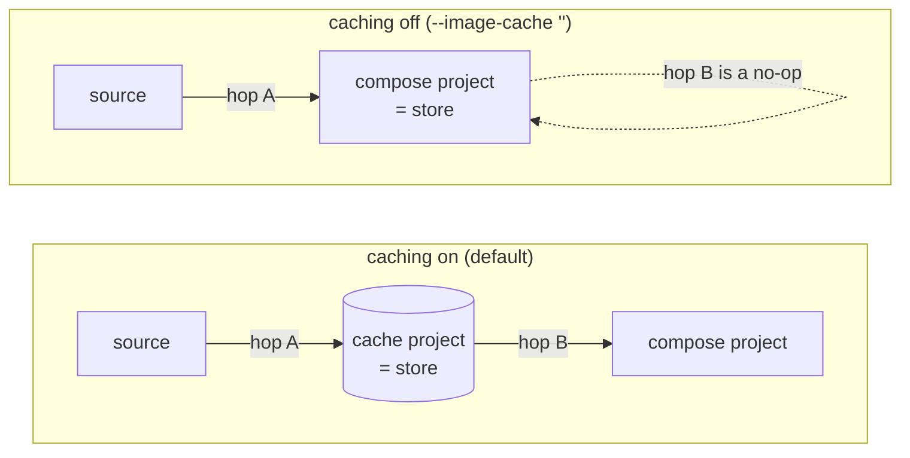
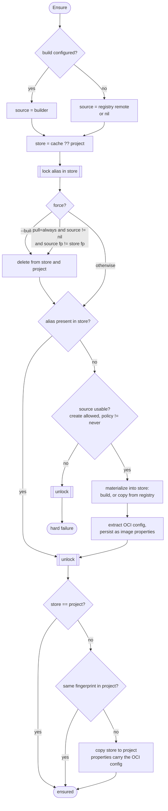
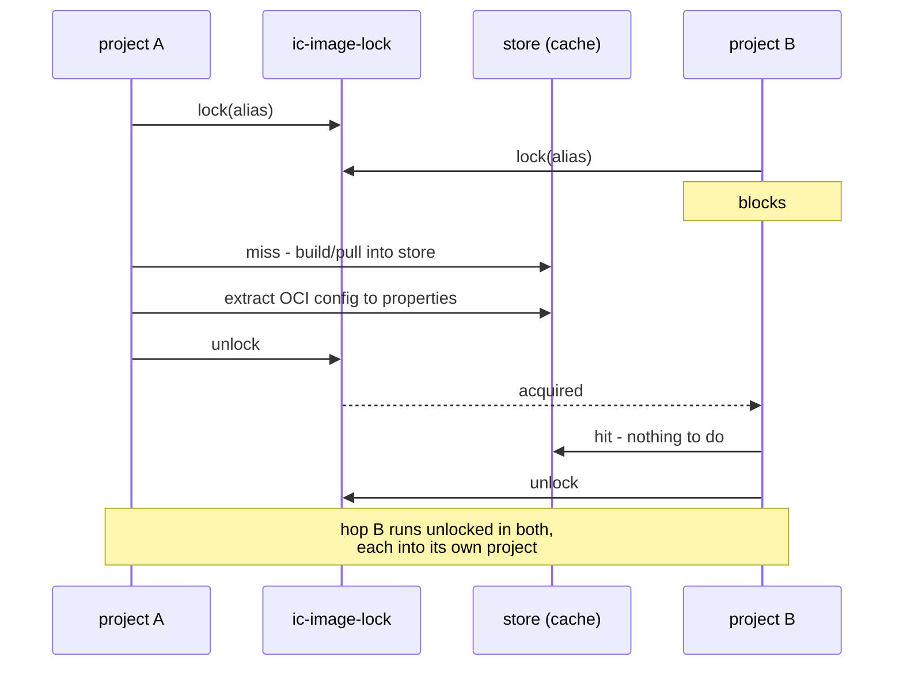

# Image Resource

The Image resource handles OCI image pulling and caching in Incus.

## 3-Stage Image Flow

Images go through three stages:

1. **Remote** - OCI registry (docker.io, ghcr.io)
2. **Cache** - Local image store (the `incus-compose-cache` project unless overridden via `--image-cache`)
3. **Project** - Per project copy of the image

Projects are created with `features.images=true`, so each project keeps its own
image store. Creating an instance copies the image from the cache into the
active project. These per-project copies are removed on `down` (see
[Delete](#delete)); the cache itself lives in a separate project and persists.

This design provides:

- **Faster subsequent runs** - no re-pulling from registry
- **No registry rate limits** - cached locally after first pull
- **Persistent cache** - survives `down`/`up` cycles and project deletion

## Image Status

Images report their status via `Status()`:

| Status  | Description        |
| ------- | ------------------ |
| Unknown | Not downloaded yet |
| Cached  | In cache project   |

## ImageConfig

Configuration for image sources:

```go
type ImageConfig struct {
    // Source is the image server to copy the image from.
    Source incusClient.ImageServer

    // CacheClient is the project-scoped client to use as the image cache
    // (for library users). Takes precedence over CacheProject.
    CacheClient *Client

    // CacheProject is the project name to use as cache (for CLI users).
    // The project will be created if it doesn't exist.
    // Ignored if CacheClient is set.
    CacheProject string

    // LockVolume names the storage volume in the cache project that holds
    // the per-alias advisory locks. Empty means DefaultLockVolume.
    LockVolume string

    // Remote is the domain part of the image reference.
    Remote string

    // Image is the image reference without the remote prefix.
    Image string
}

const (
    DefaultCacheProject = "incus-compose-cache"
    DefaultLockVolume   = "ic-image-lock"
)
```

### Cache Configuration

- **CacheClient**: For library users who manage their own cache
- **CacheProject**: For CLI users, specifies project name (auto-created); the CLI
  sets this from `--image-cache` / `INCUS_COMPOSE_IMAGE_CACHE`
- **Default**: Uses the `incus-compose-cache` project (`client.DefaultCacheProject`)

The cache is a `*Client`, not a bare `incusClient.InstanceServer`, because the
[lock volume](#locking) is a `StorageVolume` resource that has to be ensured in
the cache project - which needs the resource machinery a `*Client` carries.

```go
// Library usage - provide your own cache client
cache, _ := gc.EnsureProject("my-image-cache", EnsureProjectWithCreate())

img, _ := project.Resource(client.KindImage, "docker.io/nginx:alpine", &client.ImageConfig{
    CacheClient: cache,
})

// CLI usage - specify cache project name
img, _ := project.Resource(client.KindImage, "docker.io/nginx:alpine", &client.ImageConfig{
    CacheProject: "my-image-cache",
})

// Override the lock volume name
img, _ := project.Resource(client.KindImage, "docker.io/nginx:alpine", &client.ImageConfig{
    CacheClient: cache,
    LockVolume:  "my-locks",
})
```

`ClientLockVolume` sets the name once for every image on a client, mirroring
`ClientCacheProject`; `ImageConfig.LockVolume` overrides it per image.

## Image Reference Parsing

The reference is split into the remote, which says where to fetch from, and the
image, which is what to ask that remote for. A name whose prefix is a remote in
the Incus configuration is taken as a native `remote:image` reference;
everything else is parsed as a Docker-style one with
`github.com/distribution/reference`:

| Reference                       | Remote      | Image                   | Alias                             |
| ------------------------------- | ----------- | ----------------------- | --------------------------------- |
| `nginx:alpine`                  | `docker.io` | `library/nginx:alpine`  | `docker.io/library/nginx:alpine`  |
| `docker.io/library/alpine:3.18` | `docker.io` | `library/alpine:3.18`   | `docker.io/library/alpine:3.18`   |
| `ghcr.io/myorg/myapp:v1.0`      | `ghcr.io`   | `myorg/myapp:v1.0`      | `ghcr.io/myorg/myapp:v1.0`        |
| `alpine`                        | `docker.io` | `library/alpine:latest` | `docker.io/library/alpine:latest` |
| `localhost/myapp:dev`           | `local`     | `myapp:dev`             | `local/myapp:dev`                 |
| `images:alpine/edge`            | `images`    | `alpine/edge`           | `images:alpine/edge`              |

The alias is `Image.IncusName()`, and it is what the resource store
deduplicates on - which is why `nginx:alpine` and
`docker.io/library/nginx:alpine` are one resource rather than two. A native
reference keeps its `remote:image` form, since that is already unique.

None of the three can be set by hand: they come from the reference, so the
alias cannot disagree with what was asked for.

## Ensure Flow

### The store

There is one concept the whole flow turns on:

```
store = cache ?? project
```

With caching on, the store is the shared cache project. With caching off
(`--image-cache ""`), the store _is_ the compose project. Everything else is
expressed against `store`, which is why caching off needs no special-casing -
it collapses one hop rather than taking a different path.

Ensure is then **two hops, each skipped when the image is already there**:

| Hop | From   | To      | Skipped when                                                      |
| --- | ------ | ------- | ----------------------------------------------------------------- |
| A   | source | store   | the alias is already in the store                                 |
| B   | store  | project | `store == project`, or the project already holds that fingerprint |



### Sources

A source is either a **registry remote** or the **local builder** (a service
with `build:`). They differ only inside hop A; everything around it is shared.

The source may be `nil` - but only when the alias is already in the store.
Nothing in the store and nothing to make it from is a hard failure.

### The store hit is authoritative

If the alias is in the store, Ensure contacts **nothing**: no registry, no
builder. This is what makes "build once, use many" work - the second project
to want an image copies it out of the store instead of rebuilding or
re-pulling.

The cost is that an edited Dockerfile behind an unchanged image name is not
noticed. `--build` is the escape hatch, matching `docker compose`.

### Flow



The only source contact on the default path is the `pull=always` fingerprint
compare, which is the round trip you opt into by passing the flag.

### Pull policy

| Policy              | Behavior                                                                                       |
| ------------------- | ---------------------------------------------------------------------------------------------- |
| `missing` (default) | Store hit wins. Source is contacted only on a store miss.                                      |
| `always`            | Ask the source for its fingerprint; if it differs from the store's, delete and re-materialize. |
| `never`             | Store hit wins; a store miss is a hard failure. Never contacts the source, for air-gapped use. |

`--build` is the equivalent force for build sources, and is independent of
`--pull`.

### OCI config extraction

`ociStoreConfig` runs **once**, on the way out of hop A, and writes its result
into the image's properties. Hop B copies the image with those properties
attached, so a project copy never re-derives what is already known.

A `USER` naming a user rather than numbering one is the exception: `oci.uid`
takes nothing but a number, and only the image's own `/etc/passwd` resolves the
name. Hop A stores the value verbatim in `user.incus-compose.oci.user` and
leaves the resolution to the project, where `ResolveUser` does it alongside the
compose `user:` override.

## Reading the image

An image has no file API, so anything needing its bytes goes through
`Image.SFTP`: a stopped instance created from the image, read over SFTP. A
stopped instance mounts no disk devices, so what it shows is the image's own
rootfs.

The instance is created on first use and then kept - `SFTP` hands every caller
the same connection, and `Client.Done` removes it when the command ends. It is
named `ic-seed-*`, carries `user.incus-compose.temp=true` so a hard kill leaves
something reapable, and gets an explicit root disk because a profile-less create
fails without one.

Two callers: `StorageVolume` filling a volume from a path in the image, and
`ResolveUser`.

### ResolveUser

`ResolveUser` maps a `user[:group]` value - the compose override or the image's
own `USER` - to the numbers `oci.uid` / `oci.gid` take.

It reads the image only when it must: both sides numeric returns straight away,
which is what keeps the common case free of an instance. A name is looked up in
`/etc/passwd` or `/etc/group`, and one the image does not define is
`ErrNoSuchUser` rather than a silent 0.

A named user with no group takes that user's own group, as `login` would. A
numeric uid with no group keeps GID 0, since reading the image for it would cost
an instance per service that sets `user:`.

## Locking

Hop A is guarded by a per-alias advisory lock, so two workers - or two
separate `incus-compose` invocations - cannot pull or build the same alias
into the store at once, and a force delete cannot race a reader.

The lock lives on a custom storage volume in the cache project, named
`ic-image-lock` by default (`DefaultLockVolume`, overridable via
`ClientLockVolume` or `ImageConfig.LockVolume`). It uses
[VolumeLock](/architecture/client/storage_volume#volumelock) with `stale > 0`:
the holder heartbeats while a slow pull or a long build runs, and a crashed
holder is reaped rather than wedging the shared cache for everyone.

`Lock` is a method on `*StorageVolume`, and a `StorageVolume` only comes from
`Client.Resource` - which is why the cache has to be carried as a `*Client`
rather than an `incusClient.InstanceServer` (see
[Cache Configuration](#cache-configuration)):

```go
vol, err := cache.Resource(KindStorageVolume, lockVolume, &StorageVolumeConfig{})
err = RunAction(ctx, vol, ActionEnsure, OptionCreate())

sc, err := vol.SFTP()          // caller owns it for the whole critical section
defer sc.Close()

lock, err := vol.Lock(ctx, sc, lockName(alias), staleAfter)
defer lock.Unlock()
```

Two things to know about that API:

- **The lock name is a hash of `IncusName()`.** Aliases contain characters that
  are awkward in a path (`docker.io/library/nginx:alpine`), and a hash sidesteps
  the question entirely while guaranteeing one file per alias. `Lock` itself
  accepts nested names and creates missing parents via `MkdirAll`, so a
  path-shaped name works too - the image path just does not need one.
- **The volume appears as `vol-ic-image-lock` on the server.** `StorageVolume`
  prefixes every volume with `vol-` and sanitizes the rest, so the configured
  name is the resource name, not the Incus name. That is the same rule as any
  other compose volume.

One volume holds every lock; the per-alias granularity is one file per alias
inside it.



Hop B is deliberately outside the lock: it targets the compose project, so two
projects copying the same store image are not in conflict.

**With caching off there is no lock**, because there is no cache project to
host the volume. That is the correct outcome rather than a gap: the store is
then the compose project, which is not shared with anyone, so the race the
lock exists to prevent cannot occur.

The `"Alias already exists"` fallback - re-read and adopt the winner - stays as
a backstop for writers outside our control, such as an older `incus-compose`
or a hand-run `incus image copy`.

## Source Configuration

The source is resolved from the image reference itself, against the Incus CLI
configuration the client loaded at startup:

```go
img, _ := project.Resource(client.KindImage, "docker.io/nginx:alpine", &client.ImageConfig{})
```

A registry is somewhere the **server** is pointed at, never something
incus-compose connects to: the copy request carries the remote's address and
protocol, and incusd does the pull. Only a native `incus:` remote is dialed, to
resolve an alias to a fingerprint before the request is built.

The registries in `client.WellKnownRegistries` - `docker.io`, `ghcr.io`,
`quay.io`, `mcr.microsoft.com`, `registry.gitlab.com`, `codeberg.org` - resolve
without any setup. Anything else must be an Incus remote, and a configured
remote overrides a well-known one:

```bash
incus remote add --protocol oci registry.example.com https://registry.example.com
```

A reference whose domain is neither returns an error from Ensure:

```go
img, _ := project.Resource(client.KindImage, "registry.example.com/app:latest", &client.ImageConfig{})
err := client.RunAction(ctx, img, client.ActionEnsure, client.OptionCreate())
// err: "image source not configured"
```

## Delete

Delete removes the **per-project copy** of the image from the active project (the
copy hop B left behind). It is idempotent: if no copy
exists, it is a no-op. The cache lives in a separate project and is never touched
by Delete, so cached images persist across `down`/`up` cycles. Cache cleanup is a
separate concern (e.g. a future `prune` command). With caching off the store _is_
the project, so Delete removes the only copy and the next `up` re-materializes it.

```go
err := client.RunAction(img, client.ActionDelete) // removes active-project copy, keeps cache
```

## Refresh (`--pull always`)

`up --pull always` forces a fresh pull from the source registry before creating
instances. When the store alias already exists, `Ensure` with the `Pull` option
deletes the stale entry and re-copies from the OCI source (via `skopeo copy`). This is more reliable than `RefreshImage`: Incus fingerprints OCI
images by hashing layer digest strings, not manifest SHAs, so a registry update
that only changes manifest metadata would be invisible to `RefreshImage`
("already up to date") even though the tag points to a newer image. Without
`--pull`, an already-cached image is reused as-is.

For a registry source the stale entry is always dropped: telling whether the
tag still points at the cached digest would mean resolving it here, and
resolving an OCI reference is the server's job. A native `incus:` remote is
asked, so an unchanged image there is not re-copied.

## Built Images

A build source differs from a registry source only inside hop A: instead of
pointing the server at a remote, the builder runs and its rootfs/metadata
tarballs are uploaded into the store. Everything around it - the store-hit
check, the lock, the OCI extraction, hop B - is the same code.

That is what makes "build once, use many" work with `build:` left in the
compose file. The first `up` anywhere misses the store and builds; every
project after that finds the alias and copies. It is also why a client with no
local builder can consume an image someone else built: hop A never runs for it.
See [Builds - Reusing a built image](/builds#reusing-a-built-image-across-projects).

Because the store entry is keyed by the built image's Incus alias
(`r.incusName`, derived from the local image name), two builds that resolve to
the same image name are the same entry. `no_cache: true` opts a service out of
the shared store - it then builds into the project every time, at the cost of
no longer seeding the cache for anyone else. The same applies with `r.cache ==
nil` (`--image-cache ""`), where the store is the project to begin with. See
[Builds - Image Caching](/builds#image-caching) for the user-facing version.

_Since: v1.1.0_

## Podman Compatibility

Images with "localhost" remote (common in podman) are converted to "local":

```go
// Input: "localhost/myimage:latest"
// Remote becomes: "local"
```

## Priority and Parallel Downloads

Images have priority 1024, placing them after profiles but before networks.

When Stack.Run processes multiple images, they download in parallel via WorkerPool.

## Auto-Update

Images are configured with `AutoUpdate: true`. Incus periodically checks the source registry and refreshes the cached image. Running containers are not affected; new containers use the updated image.
