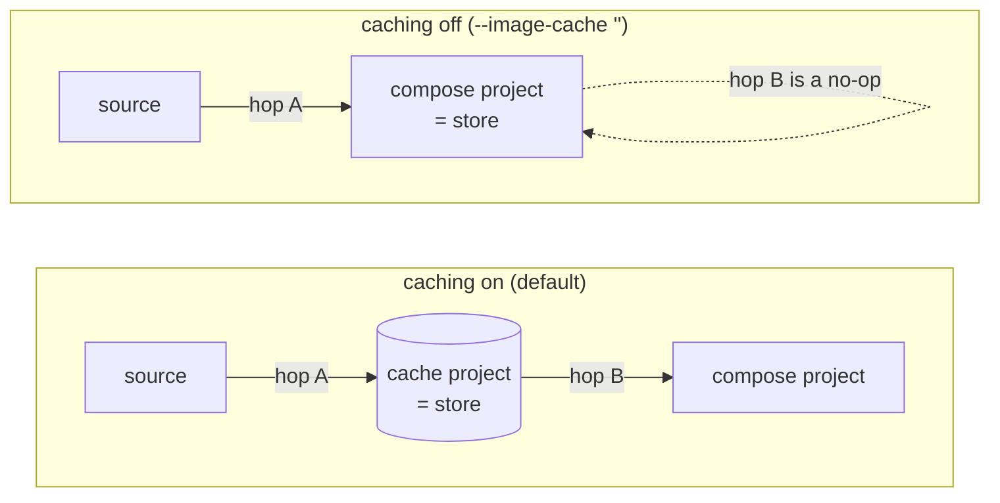
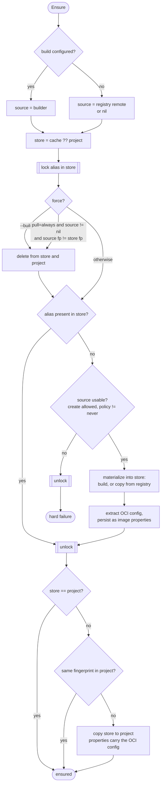
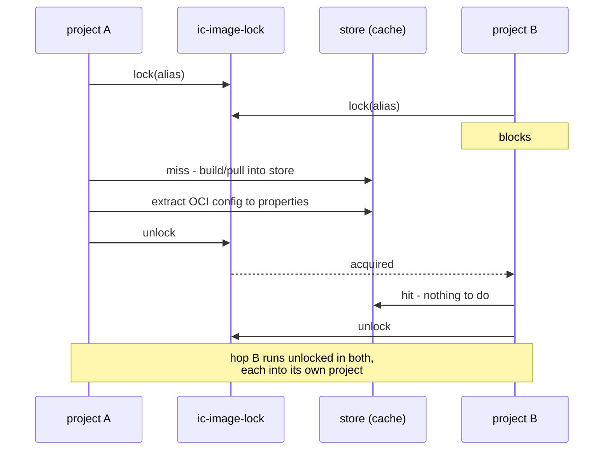

# Image Resource

The Image resource handles OCI image pulling and caching in Incus.

## 3-Stage Image Flow

Images go through three stages:

1. **Remote** - OCI registry (docker.io, ghcr.io)
2. **Cache** - Local image store (the `default` project unless overridden via `--image-cache`)
3. **Project** - Per project copy of the image

Projects are created with `features.images=true`, so each project keeps its own
image store. Creating an instance copies the image from the cache into the
active project. These per-project copies are removed on `down` (see
[Delete](#delete)); the cache itself lives in a separate project and persists.

This design provides:

- **Faster subsequent runs** - no re-pulling from registry
- **No registry rate limits** - cached locally after first pull
- **Persistent cache** - survives `down`/`up` cycles and project deletion

## Image Status

Images report their status via `Status()`:

| Status  | Description        |
| ------- | ------------------ |
| Unknown | Not downloaded yet |
| Cached  | In cache project   |

## ImageConfig

Configuration for image sources:

```go
type ImageConfig struct {
    // Source is the image server to copy the image from.
    Source incusClient.ImageServer

    // CacheServer is an image server to use as cache (for library users).
    // Takes precedence over CacheProject.
    CacheServer incusClient.InstanceServer

    // CacheProject is the project name to use as cache (for CLI users).
    // The project will be created if it doesn't exist.
    // Ignored if CacheServer is set.
    CacheProject string

    // Remote is the domain part of the image reference.
    Remote string

    // Image is the image reference without the remote prefix.
    Image string
}
```

### Cache Configuration

- **CacheServer**: For library users who manage their own cache
- **CacheProject**: For CLI users, specifies project name (auto-created); the CLI
  sets this from `--image-cache` / `INCUS_COMPOSE_IMAGE_CACHE`
- **Default**: Uses the `default` project

```go
// Library usage - provide your own cache server
img, _ := project.Resource(client.KindImage, "docker.io/nginx:alpine", &client.ImageConfig{
    Source:      imageServer,
    CacheServer: myCacheServer,
})

// CLI usage - specify cache project name
img, _ := project.Resource(client.KindImage, "docker.io/nginx:alpine", &client.ImageConfig{
    Source:       imageServer,
    CacheProject: "my-image-cache",
})
```

## Image Reference Parsing

Docker-style references are parsed using `github.com/distribution/reference`:

```go
// Input: "nginx:alpine"
// Parsed:
//   Remote: "docker.io"
//   Image:  "library/nginx:alpine"

// Input: "docker.io/library/alpine:3.18"
// Parsed:
//   Remote: "docker.io"
//   Image:  "library/alpine:3.18"

// Input: "ghcr.io/myorg/myapp:v1.0"
// Parsed:
//   Remote: "ghcr.io"
//   Image:  "myorg/myapp:v1.0"

// Input: "alpine" (no tag)
// Parsed:
//   Remote: "docker.io"
//   Image:  "library/alpine:latest"
```

Config can override parsing:

```go
img, _ := project.Resource(client.KindImage, "custom-name", &client.ImageConfig{
    Source: imageServer,
    Remote: "custom.registry.io",
    Image:  "myimage:v2",
})
```

## Ensure Flow

:::warning
This section describes the target design. The implementation is being
reworked to match it; where the two disagree today, the code is what runs.
:::

### The store

There is one concept the whole flow turns on:

```
store = cache ?? project
```

With caching on, the store is the shared cache project. With caching off
(`--image-cache ""`), the store *is* the compose project. Everything else is
expressed against `store`, which is why caching off needs no special-casing -
it collapses one hop rather than taking a different path.

Ensure is then **two hops, each skipped when the image is already there**:

| Hop | From | To | Skipped when |
| --- | --- | --- | --- |
| A | source | store | the alias is already in the store |
| B | store | project | `store == project`, or the project already holds that fingerprint |



### Sources

A source is either a **registry remote** or the **local builder** (a service
with `build:`). They differ only inside hop A; everything around it is shared.

The source may be `nil` - but only when the alias is already in the store.
Nothing in the store and nothing to make it from is a hard failure.

### The store hit is authoritative

If the alias is in the store, Ensure contacts **nothing**: no registry, no
builder. This is what makes "build once, use many" work - the second project
to want an image copies it out of the store instead of rebuilding or
re-pulling.

The cost is that an edited Dockerfile behind an unchanged image name is not
noticed. `--build` is the escape hatch, matching `docker compose`.

### Flow



The only source contact on the default path is the `pull=always` fingerprint
compare, which is the round trip you opt into by passing the flag.

### Pull policy

| Policy | Behavior |
| --- | --- |
| `missing` (default) | Store hit wins. Source is contacted only on a store miss. |
| `always` | Ask the source for its fingerprint; if it differs from the store's, delete and re-materialize. |
| `never` | Store hit wins; a store miss is a hard failure. Never contacts the source, for air-gapped use. |

`--build` is the equivalent force for build sources, and is independent of
`--pull`.

### OCI config extraction

`extractAndStoreOCIConfig` runs **once**, on the way out of hop A, and writes
its result into the image's properties. Hop B copies the image with those
properties attached, so a project copy never spins up a temporary instance to
re-derive what is already known.

## Locking

Hop A is guarded by a per-alias advisory lock, so two workers - or two
separate `incus-compose` invocations - cannot pull or build the same alias
into the store at once, and a force delete cannot race a reader.

The lock lives on a custom storage volume named **`ic-image-lock`** in the
cache project, using [VolumeLock](/architecture/client/storage_volume#volumelock)
with `stale > 0`: the holder heartbeats while a slow pull or a long build runs,
and a crashed holder is reaped rather than wedging the shared cache for
everyone.



Hop B is deliberately outside the lock: it targets the compose project, so two
projects copying the same store image are not in conflict.

**With caching off there is no lock**, because there is no cache project to
host the volume. That is the correct outcome rather than a gap: the store is
then the compose project, which is not shared with anyone, so the race the
lock exists to prevent cannot occur.

The `"Alias already exists"` fallback - re-read and adopt the winner - stays as
a backstop for writers outside our control, such as an older `incus-compose`
or a hand-run `incus image copy`.

## Source Configuration

The Source field requires an ImageServer from Incus CLI config:

```go
conf, _ := cliconfig.LoadConfig("")
imageServer, _ := conf.GetImageServer("docker.io")

img, _ := project.Resource(client.KindImage, "docker.io/nginx:alpine", &client.ImageConfig{
    Source: imageServer,
})
```

Registries must be configured as Incus remotes:

```bash
incus remote add --protocol oci docker.io https://docker.io
incus remote add --protocol oci ghcr.io https://ghcr.io
```

Calling Ensure with `OptionCreate()` but no Source returns an error:

```go
img, _ := project.Resource(client.KindImage, "docker.io/nginx:alpine", &client.ImageConfig{
    // No Source!
})
err := client.RunAction(img, client.ActionEnsure, client.OptionCreate())
// err: "image source not configured"
```

## Delete

Delete removes the **per-project copy** of the image from the active project (the
copy left behind by `CreateInstanceFromImage`). It is idempotent: if no copy
exists, it is a no-op. The cache lives in a separate project and is never touched
by Delete, so cached images persist across `down`/`up` cycles. Cache cleanup is a
separate concern (e.g. a future `prune` command).

```go
err := client.RunAction(img, client.ActionDelete) // removes active-project copy, keeps cache
```

## Refresh (`--pull`)

`up --pull` (and `redeploy`) force a fresh pull from the source registry before
creating instances. When the cached alias already exists, `Ensure` with the `Pull`
option deletes the stale cache entry and re-copies from the OCI source (via
`skopeo copy`). This is more reliable than `RefreshImage`: Incus fingerprints OCI
images by hashing layer digest strings, not manifest SHAs, so a registry update
that only changes manifest metadata would be invisible to `RefreshImage`
("already up to date") even though the tag points to a newer image. Without
`--pull`, an already-cached image is reused as-is.

## Built Images and Caching (current behavior)

:::warning
This section documents the code as it stands. The
[Ensure Flow](#ensure-flow) above is the target it is being reworked towards;
the differences are called out below.
:::

`ensureBuild`/`buildImage` (the `Config.Build != nil` path) write through the
cache the same way the pull path does: the rootfs/metadata tarball goes into
`r.cache` first, then gets copied into the project via `CopyImage`.

The read side is **not** mirrored. `ensureBuild` only checks `r.conn` (the
active project) before deciding to build, never `r.cache`, and `buildImage`
always runs the builder. So a service that declares `build:` rebuilds in every
project, even when the cache already holds that alias - the cache copy is
written, never read back, on this path.

Two gaps against the target design, both on this path:

- **No store read.** Hop A's `alias present in store?` check does not exist for
  builds, which is why the rebuild happens.
- **No lock.** `buildImage` deletes the cache alias and recreates it with no
  mutual exclusion, and without the pull path's `"Alias already exists"`
  fallback, so concurrent builds of one alias race.

Until that lands, "build once, serve many" goes through the pull path: once a
build has populated the cache, any project that references the image *by name*,
with no `build:` block of its own, resolves it through `create()` and gets a
cache hit instead of a registry fetch. That is how the ic-healthd sidecar image
is built once by CI/dev tooling and reused everywhere - including by clients
that cannot build locally at all.
See [Builds - Reusing a built image](/builds#reusing-a-built-image-across-projects).

`buildImage` takes the direct-to-project path instead when either is true:

- `buildCfg.NoCache` is set (compose `build.no_cache: true` or CLI `--no-cache`)
- `r.cache == nil` (no image cache configured, e.g. `--image-cache ""`)

Because the cache entry is keyed by the built image's Incus alias
(`r.incusName`, derived from the local image name), two different builds
that resolve to the same image name collide in the cache - the later build
wins. `no_cache: true` is the per-service escape hatch from that collision,
at the cost of no longer seeding the cache for other projects. See
[Builds - Image Caching](/builds#image-caching) for the user-facing version.

_Since: v1.1.0_

## Podman Compatibility

Images with "localhost" remote (common in podman) are converted to "local":

```go
// Input: "localhost/myimage:latest"
// Remote becomes: "local"
```

## Priority and Parallel Downloads

Images have priority 1024, placing them after profiles but before networks.

When Stack.Run processes multiple images, they download in parallel via WorkerPool.

## Auto-Update

Images are configured with `AutoUpdate: true`. Incus periodically checks the source registry and refreshes the cached image. Running containers are not affected; new containers use the updated image.
