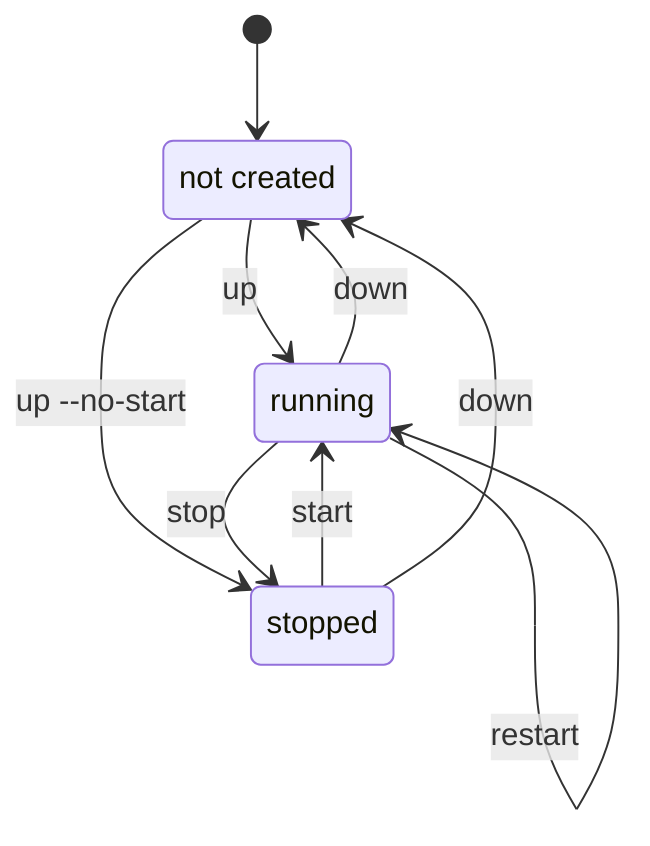

# CLI Reference

## Instance Lifecycle

Which command leaves you where:



`down` removes the instances and the per-project image copies but keeps volumes
and the shared image cache. `down --volumes` also deletes the volumes;
`down --project` removes the whole Incus project.

## Global Options

Every option below (and every command-specific one further down) can also be
set via an environment variable - see [Environment Variables](/environment-variables)
for the full list.

| Option                      | Description                                                                                                                        |
| --------------------------- | ---------------------------------------------------------------------------------------------------------------------------------- |
| `-f`, `--file`              | Compose files (repeatable)                                                                                                         |
| `-p`, `--project-name`      | Project name                                                                                                                       |
| `-P`, `--project-directory` | Working directory                                                                                                                  |
| `--profile`                 | Compose profiles (repeatable)                                                                                                      |
| `--env-file`                | Environment files (repeatable)                                                                                                     |
| `-E`, `--os-env`            | Include OS env vars                                                                                                                |
| `--remote`                  | Incus remote                                                                                                                       |
| `--ansi`                    | Color output: never/always/auto                                                                                                    |
| `--image-cache`             | Incus project used as image cache (default: `incus-compose-cache`); set `""` to disable caching and pull straight into the project |
| `--storage-pool`            | Default storage pool for volumes (default: `detect` for auto-detection)                                                            |
| `--workers`                 | Number of concurrent workers (default: `4`)                                                                                        |
| `--debug`                   | Debug logging                                                                                                                      |

Supports the [no-color.org](https://no-color.org/) convention.

### Disabling the Cache

Set `--image-cache ""` to skip the cache project and pull images straight into
each project instead. This trades the shared cache (and its rate-limit/re-pull
savings) for one fewer copy per image - useful if you don't want a persistent
cache project on the server at all.

## up

Create and start containers.

```
incus-compose up [SERVICE...]
```

| Option                 | Description                                                                                                                                                                                |
| ---------------------- | ------------------------------------------------------------------------------------------------------------------------------------------------------------------------------------------ |
| `-d`, `--detach`       | Detached mode: run containers in the background                                                                                                                                            |
| `--recreate`           | Recreate containers even if they exist                                                                                                                                                     |
| `--no-start`           | Don't start containers after creating                                                                                                                                                      |
| `--pull`               | Pull policy: `always` (refresh from the registry), `missing`/`policy` (use the store if present), `never` (never contact a registry; fail when the image is not stored); default: `policy` |
| `--build`              | Rebuild build-configured service images before starting containers                                                                                                                         |
| `--no-build`           | Do not build images; fail if a required built image is missing                                                                                                                             |
| `--builder`            | Preferred builder, binary name or absolute path; empty for auto-detect                                                                                                                     |
| `--no-deps`            | Don't start linked services (depends_on)                                                                                                                                                   |
| `--timeout`            | Stop/start timeout (default: 1m)                                                                                                                                                           |
| `--dependency-timeout` | Max time to wait for `service_healthy` depends_on (default: 5m; `0` = no limit)                                                                                                            |
| `--scale`              | Scale service: `web=3` (repeatable)                                                                                                                                                        |
| `--no-healthd`         | Don't create healthd sidecar for healthchecks                                                                                                                                              |
| `--external-healthd`   | Use an existing (unmanaged) healthd; don't create or look one up                                                                                                                           |
| `--healthd-image`      | Healthd OCI image; `{version}` is replaced with the incus-compose version                                                                                                                  |
| `--healthd-binary`     | Path to local ic-healthd binary (uses images:alpine/edge instead of OCI image)                                                                                                             |
| `--healthd-incus`      | Incus API URL healthd connects to; overrides `x-incus-compose.healthd.incus`; unset uses `core.https_address`, else the bridge IP                                                          |
| `--healthd-network`    | Network for healthd; overrides `x-incus-compose.healthd.network`; the bridge of the project it runs in if unset                                                                            |
| `--healthd-scope`      | `global` (shared daemon in the Incus `incus-compose` project, the default) or `project`; loses to a scope the project already carries                                                      |

Without `--detach`, `up` streams logs from all started services (equivalent to running `logs --follow` immediately after). Use `--detach` to return as soon as containers are started.

For services with `build:`, `up` builds missing images by default. Use `--build` to force a rebuild or `--no-build` to require the image to already exist. See [Builds](/builds) for details.

## build

Build or rebuild service images for services that define `build:`.

```
incus-compose build [SERVICE...]
```

| Option       | Description                                                                                                                                                                                     |
| ------------ | ----------------------------------------------------------------------------------------------------------------------------------------------------------------------------------------------- |
| `--no-cache` | Disable the builder's layer cache, and skip the shared image cache the build would otherwise land in (see [Builds - Image Caching](/builds#image-caching))                                      |
| `--pull`     | Pull policy for the images this build depends on: `always`, `missing`/`policy`, `never`. Base-image freshness is the builder's own concern, set `build.pull: true` in the compose file for that |

When service names are provided, only matching build-configured services are built. Services without `build:` are skipped. Built images are imported into the Incus project and used by `up`.

See [Builds](/builds): for supported Compose build options and requirements.

## down

Stop and remove containers. Per-project image copies are removed too; volumes and
the image cache are kept. Use `--volumes` to also delete volumes while keeping the
project, or `--project` to remove everything (project and volumes).

```
incus-compose down [SERVICE...]
```

| Option               | Description                                                              |
| -------------------- | ------------------------------------------------------------------------ |
| `--project`          | Remove the project (and its volumes)                                     |
| `--volumes`          | Also delete volumes, but keep the project                                |
| `--rmi`              | Remove images used by services: `local` or `all` (docker compose compat) |
| `--images`           | Remove known images from the project (equivalent to `--rmi local`)       |
| `--timeout`          | Stop timeout (default: 10s)                                              |
| `--no-deps`          | Don't stop linked services (depends_on)                                  |
| `--no-networks`      | Don't touch networks                                                     |
| `--external-healthd` | Use an existing (unmanaged) healthd; don't look one up                   |
| `--no-healthd`       | Don't stop/remove healthd sidecar                                        |

_Changed in 1.0.0-rc.1_: `--volumes` is now no more an alias for `--project` but deletes volumes.

## start

Start stopped services.

```
incus-compose start [SERVICE...]
```

| Option         | Description                                                       |
| -------------- | ----------------------------------------------------------------- |
| `--timeout`    | Start timeout (default: 1m)                                       |
| `--with-deps`  | Also start linked services (depends_on) — incus-compose extension |
| `--no-healthd` | Don't start healthd sidecar                                       |

## stop

Stop running services.

```
incus-compose stop [SERVICE...]
```

| Option         | Description                                                      |
| -------------- | ---------------------------------------------------------------- |
| `--timeout`    | Stop timeout (default: 10s)                                      |
| `--with-deps`  | Also stop linked services (depends_on) — incus-compose extension |
| `--no-healthd` | Don't stop healthd sidecar                                       |

## restart

Restart running services.

```
incus-compose restart [SERVICE...]
```

| Option         | Description                                                         |
| -------------- | ------------------------------------------------------------------- |
| `--timeout`    | Stop/start timeout (default: 1m)                                    |
| `--with-deps`  | Also restart linked services (depends_on) — incus-compose extension |
| `--no-healthd` | Don't stop/start healthd sidecar                                    |

### Linked services

`up` and `down` follow `depends_on` by default: naming a service pulls in the
services it links to (its dependencies on `up`, its dependents on `down`). Use
`--no-deps` to act on exactly the named services. On `up`, `--no-deps` also
skips waiting on `depends_on: { condition: service_healthy }` for the
out-of-scope dependencies, so the named service starts without them.

`start`, `stop`, `restart`, `logs`, and `ps` act on exactly the named services
by default, matching `docker compose start`/`stop`. The `--with-deps` flag is an
incus-compose extension that opts those commands into following `depends_on` the
same way `up`/`down` do.

## logs

View container output.

```
incus-compose logs [SERVICE...]
```

| Option           | Description                                                                |
| ---------------- | -------------------------------------------------------------------------- |
| `-f`, `--follow` | Follow output                                                              |
| `--with-deps`    | Also show logs from linked services (depends_on) — incus-compose extension |

Missing instances are skipped with a warning; logs from available instances are still shown.

## config

Validate and render compose file.

```
incus-compose config [SERVICE...]
```

| Option           | Description                              |
| ---------------- | ---------------------------------------- |
| `--format`       | yaml (default) or json                   |
| `-q`, `--quiet`  | Validate only                            |
| `--services`     | List services                            |
| `--volumes`      | List volumes                             |
| `--networks`     | List networks                            |
| `--profiles`     | List profiles                            |
| `--images`       | List images                              |
| `--environment`  | Print environment used for interpolation |
| `--variables`    | Print model variables and default values |
| `-o`, `--output` | Save to file                             |

## exec

Execute a command in a running instance.

```
incus-compose exec [options] SERVICE COMMAND [ARGS...]
```

| Option            | Description                                                            |
| ----------------- | ---------------------------------------------------------------------- |
| `-d`, `--detach`  | Run command in the background                                          |
| `--dry-run`       | Execute command in dry run mode                                        |
| `-e`, `--env`     | Set environment variables `KEY=VALUE` (repeatable)                     |
| `--index`         | Index of the container if service has multiple replicas (default: 0)   |
| `-T`, `--no-tty`  | Disable pseudo-TTY allocation                                          |
| `--privileged`    | Give extended privileges to the process (accepted but not implemented) |
| `-u`, `--user`    | Run the command as this user (default: the instance's UID)             |
| `-g`, `--group`   | Run the command as this group (default: the instance's GID)            |
| `-w`, `--workdir` | Path to workdir directory for this command                             |

`exec` shells out to your local `incus` client and targets the instance via
`INCUS_PROJECT`. It uses your local Incus remote configuration (`incus remote`),
not incus-compose's own connection settings.

Like `docker compose exec`, the command runs as the instance's user and group by
default — the image's `oci.uid` / `oci.gid`, or the numeric IDs from the service
[`user:`](/compose-compatibility#user) override. Pass `--user` / `--group` to run
as someone else:

```bash
incus-compose exec web id             # runs as the instance's user (e.g. 1000:1000)
incus-compose exec --user 0 web id    # runs as root
```

The command and its arguments are passed to Incus verbatim, so flags with leading
dashes work without escaping:

```bash
incus-compose exec web ls -ln /data
incus-compose exec web sh -c 'echo hello > /data/test.txt'
```

_Changed in 1.0.0-beta.22_: exec uses the instances UID/GID by default.

## ps

List containers (instances).

```
incus-compose ps [SERVICE...]
```

| Option          | Description                                                      |
| --------------- | ---------------------------------------------------------------- |
| `-a`, `--all`   | Show all containers (including stopped ones)                     |
| `-q`, `--quiet` | Only display Incus instance names                                |
| `--services`    | Display compose service names instead of instances               |
| `--format`      | table (default) or json                                          |
| `--with-deps`   | Also list linked services (depends_on) — incus-compose extension |

## pull

Pull service images.

```
incus-compose pull [SERVICE...]
```

| Option                          | Description                                                                    |
| ------------------------------- | ------------------------------------------------------------------------------ |
| `--ignore-buildable`            | Ignore images that can be built                                                |
| `--ignore-build-failures`       | Pull what it can and ignores images with pull failures                         |
| `--policy`                      | Pull policy: `always` (default), `missing`, `never`                            |
| `--no-healthd`                  | Don't pull the healthd sidecar                                                 |
| `--healthd-image`               | Healthd OCI image to use; {version} is replaced with the incus-compose version |
| `--include-deps`, `--with-deps` | Also pull linked services                                                      |

## incus

Run any `incus` command scoped to the current compose project. All flags and arguments are passed through verbatim; only `INCUS_PROJECT` is injected.

```
incus-compose incus COMMAND [ARGS...]
```

Examples:

```bash
incus-compose incus list                        # list instances in this project
incus-compose incus config show web-1           # show instance config
incus-compose incus config set web-1 limits.memory 512MiB
incus-compose incus exec web-1 -- bash
```

Equivalent to `INCUS_PROJECT=<project> incus COMMAND [ARGS...]`.

## healthd

Manage the ic-healthd sidecar. See [Health Checking](/healthd) for full details.

```
incus-compose healthd <subcommand>
```

| Subcommand        | Description                                               |
| ----------------- | --------------------------------------------------------- |
| `logs [--follow]` | Stream the ic-healthd container log                       |
| `reload`          | Send SIGHUP to the ic-healthd process                     |
| `restart`         | Restart the ic-healthd container                          |
| `up`              | Create the sidecar, or replace one running an older image |
| `down [--force]`  | Stop and remove the sidecar                               |

Each follows the project's scope, so in a `global`-scope project they act on the
shared daemon in the Incus `incus-compose` project. With no compose file present they
shared daemon in the Incus `default` project. With no compose file present they

shared daemon in the Incus `incus-compose-healthd` project. With no compose file present they

> > > > > > > v1.2
> > > > > > > all act on the shared daemon directly: `healthd up` creates one, the rest fail
> > > > > > > with `no ic-healthd is running` when there is none. `healthd down` asks first
> > > > > > > when other projects rely on that daemon; `--force` skips the question and is
> > > > > > > required without a terminal.

`healthd up` also accepts `--image`, `--binary`, `--incus`, `--network`,
`--scope`, `--pull` and `--timeout`. See
[Health Checking - Scope](/healthd#scope-one-daemon-or-one-per-project) and
[Network Configuration](/healthd#network-configuration).

## list

List project resources.

```
incus-compose list [SERVICE...]
```

| Option         | Description                                    |
| -------------- | ---------------------------------------------- |
| `--format`     | table (default), yaml, json                    |
| `--no-healthd` | Exclude the ic-healthd sidecar from the output |

The `IMAGE` column shows the compose image for each service. The ic-healthd sidecar is listed by default; its image is resolved from the instance's stored metadata. Pass `--no-healthd` to omit it.

_Changed in 1.0.0-rc.1_: healthd is listed by default.

## version

Print the incus-compose version.

```
incus-compose version
```

## self-update

Update incus-compose to the latest release from GitHub.

```
incus-compose self-update
```

| Option          | Description                                                                               |
| --------------- | ----------------------------------------------------------------------------------------- |
| `--draft`       | Also consider draft releases when checking for updates (works only with GITHUB_TOKEN set) |
| `--pre-release` | Also consider pre-releases when checking for updates                                      |

This command is only available when both conditions are met:

1. The binary was built with a release version (not `latest` / development builds)
2. The binary file is writable by the current user

When available, `self-update` checks the [lxc/incus-compose](https://github.com/lxc/incus-compose) GitHub releases for a newer version matching the current OS and architecture. If a newer version is found, the binary is replaced in-place. If you are already on the latest version, no action is taken.

_Changed v1.0.0: the `--drafts` option has been added_

## Docker Compose command parity

Most `docker compose` verbs map directly. Anything without a dedicated command is
reachable through the `incus-compose incus` passthrough, which runs any `incus`
command scoped to the current project.

| `docker compose`             | incus-compose                            | Notes                                         |
| ---------------------------- | ---------------------------------------- | --------------------------------------------- |
| `up`                         | `up`                                     |                                               |
| `down`                       | `down`                                   |                                               |
| `start` / `stop` / `restart` | `start` / `stop` / `restart`             |                                               |
| `ps`                         | `ps`                                     |                                               |
| `logs`                       | `logs`                                   |                                               |
| `exec`                       | `exec`                                   |                                               |
| `build`                      | `build`                                  |                                               |
| `config`                     | `config`                                 |                                               |
| `pull`                       | `pull`                                   |                                               |
| `images`                     | `config --images`                        | Or `incus-compose incus image list`.          |
| `cp`                         | `incus-compose incus file push` / `pull` |                                               |
| `top`                        | `incus-compose incus top`                |                                               |
| `events`                     | `incus-compose incus monitor`            |                                               |
| `kill`                       | `stop --timeout 0`                       | Forces an immediate stop.                     |
| `run`                        | not implemented                          | Use `up` then `exec`.                         |
| `pause` / `unpause`          | not implemented                          | Use the `incus-compose incus` passthrough.    |
| `port`                       | not implemented                          | Published ports are shown in `config` / `ps`. |
