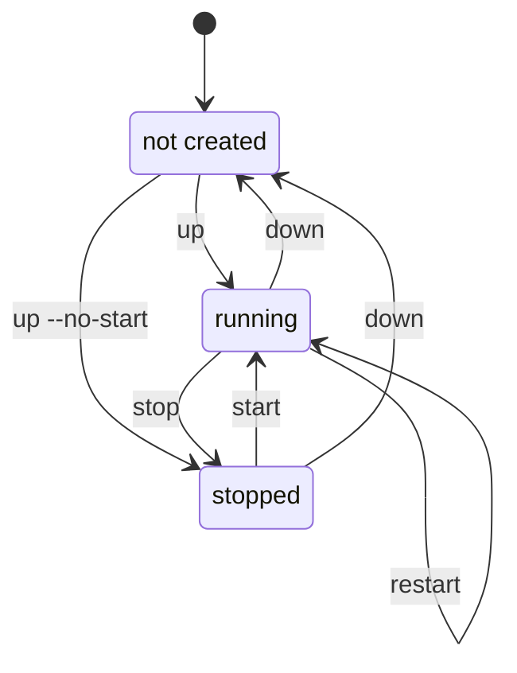

# CLI Reference

## Instance Lifecycle

Which command leaves you where:



`down` removes the instances and the per-project image copies but keeps volumes
and the shared image cache. `down --volumes` also deletes the volumes;
`down --project` removes the whole Incus project.

## Global Options

Every option below (and every command-specific one further down) can also be
set via an environment variable - see [Environment Variables](/environment-variables)
for the full list.

| Option                      | Description                                                                                                                        |
| --------------------------- | ---------------------------------------------------------------------------------------------------------------------------------- |
| `-f`, `--file`              | Compose files (repeatable)                                                                                                         |
| `-p`, `--project-name`      | Project name                                                                                                                       |
| `-P`, `--project-directory` | Working directory                                                                                                                  |
| `--profile`                 | Compose profiles (repeatable)                                                                                                      |
| `--env-file`                | Environment files (repeatable)                                                                                                     |
| `-E`, `--os-env`            | Include OS env vars                                                                                                                |
| `--remote`                  | Incus remote                                                                                                                       |
| `--ansi`                    | Color output: never/always/auto                                                                                                    |
| `--image-cache`             | Incus project used as image cache (default: `incus-compose-cache`); set `""` to disable caching and pull straight into the project |
| `--storage-pool`            | Default storage pool for volumes (default: `detect` for auto-detection)                                                            |
| `--workers`                 | Number of concurrent workers (default: `4`)                                                                                        |
| `--debug`                   | Debug logging                                                                                                                      |

Supports the [no-color.org](https://no-color.org/) convention.

### Disabling the Cache

Set `--image-cache ""` to skip the cache project and pull images straight into
each project instead. This trades the shared cache (and its rate-limit/re-pull
savings) for one fewer copy per image - useful if you don't want a persistent
cache project on the server at all.

## up

Create and start containers.

```
incus-compose up [SERVICE...]
```

| Option                 | Description                                                                                                                                                                                |
| ---------------------- | ------------------------------------------------------------------------------------------------------------------------------------------------------------------------------------------ |
| `-d`, `--detach`       | Detached mode: run containers in the background                                                                                                                                            |
| `--recreate`           | Recreate containers even if they exist                                                                                                                                                     |
| `--no-start`           | Don't start containers after creating; implies `--detach`                                                                                                                                  |
| `--pull`               | Pull policy: `always` (refresh from the registry), `missing`/`policy` (use the store if present), `never` (never contact a registry; fail when the image is not stored); default: `policy` |
| `--build`              | Rebuild build-configured service images before starting containers, recreating the instances that use them                                                                                 |
| `--no-build`           | Do not build images; fail if a required built image is missing                                                                                                                             |
| `--builder`            | Preferred builder, binary name or absolute path; empty for auto-detect                                                                                                                     |
| `--no-deps`            | Don't start linked services (depends_on)                                                                                                                                                   |
| `--timeout`            | Stop/start timeout (default: 1m)                                                                                                                                                           |
| `--dependency-timeout` | Max time to wait for `service_healthy` depends_on (default: 5m; `0` = no limit)                                                                                                            |
| `--scale`              | Scale service: `web=3` (repeatable)                                                                                                                                                        |
| `--no-healthd`         | Don't create healthd sidecar for healthchecks                                                                                                                                              |
| `--external-healthd`   | Use an existing (unmanaged) healthd; don't create or look one up                                                                                                                           |
| `--healthd-image`      | Healthd OCI image; `{version}` is replaced with the incus-compose version                                                                                                                  |
| `--healthd-binary`     | Path to local ic-healthd binary (uses images:alpine/edge instead of OCI image)                                                                                                             |
| `--healthd-incus`      | Incus API URL healthd connects to; overrides `x-incus-compose.healthd.incus`; unset uses `core.https_address`, else the bridge IP                                                          |
| `--healthd-network`    | Network for healthd; overrides `x-incus-compose.healthd.network`; the bridge of the project it runs in if unset                                                                            |
| `--healthd-scope`      | `global` (shared daemon in the Incus `incus-compose` project, the default) or `project`; loses to a scope the project already carries                                                      |

Without `--detach`, `up` streams logs from all started services (equivalent to running `logs --follow` immediately after). Use `--detach` to return as soon as containers are started. `--no-start` implies it: there is nothing to stream logs from.

For services with `build:`, `up` builds missing images by default. Use `--build` to force a rebuild or `--no-build` to require the image to already exist. `--build` also recreates the instances of the services whose image it rebuilt - a rebuilt image only reaches an instance created from it again. Every other service is left alone; `--recreate` is how you recreate the whole project. See [Builds](/builds) for details.

## build

Build or rebuild service images for services that define `build:`.

```
incus-compose build [SERVICE...]
```

| Option       | Description                                                                                                                                                                                     |
| ------------ | ----------------------------------------------------------------------------------------------------------------------------------------------------------------------------------------------- |
| `--no-cache` | Disable the builder's layer cache, and skip the shared image cache the build would otherwise land in (see [Builds - Image Caching](/builds#image-caching))                                      |
| `--pull`     | Pull policy for the images this build depends on: `always`, `missing`/`policy`, `never`. Base-image freshness is the builder's own concern, set `build.pull: true` in the compose file for that |

When service names are provided, only matching build-configured services are built. Services without `build:` are skipped. Built images are imported into the Incus project and used by `up`.

See [Builds](/builds): for supported Compose build options and requirements.

## down

Stop and remove containers. Per-project image copies are removed too; volumes and
the image cache are kept. Use `--volumes` to also delete volumes while keeping the
project, or `--project` to remove everything (project and volumes).

```
incus-compose down [SERVICE...]
```

| Option               | Description                                                              |
| -------------------- | ------------------------------------------------------------------------ |
| `--project`          | Remove the project (and its volumes)                                     |
| `--volumes`          | Also delete volumes, but keep the project                                |
| `--rmi`              | Remove images used by services: `local` or `all` (docker compose compat) |
| `--images`           | Remove known images from the project (equivalent to `--rmi local`)       |
| `--timeout`          | Stop timeout (default: 10s)                                              |
| `--no-deps`          | Don't stop linked services (depends_on)                                  |
| `--no-networks`      | Don't touch networks                                                     |
| `--external-healthd` | Use an existing (unmanaged) healthd; don't look one up                   |
| `--no-healthd`       | Don't stop/remove healthd sidecar                                        |

An instance takes its own volumes down with it, so `--volumes` reaches the ones
[an image declared](/compose-compatibility#image-volumes) as well. After a plain
`down` the instance is gone and there is nothing left to ask: those volumes stay
until `--project`, or until the next `up` recreates the instance that owns them.

_Changed in 1.0.0-rc.1_: `--volumes` is now no more an alias for `--project` but deletes volumes.

## start

Start stopped services.

```
incus-compose start [SERVICE...]
```

| Option         | Description                                                       |
| -------------- | ----------------------------------------------------------------- |
| `--timeout`    | Start timeout (default: 1m)                                       |
| `--with-deps`  | Also start linked services (depends_on) - incus-compose extension |
| `--no-healthd` | Don't start healthd sidecar                                       |

## stop

Stop running services.

```
incus-compose stop [SERVICE...]
```

| Option         | Description                                                      |
| -------------- | ---------------------------------------------------------------- |
| `--timeout`    | Stop timeout (default: 10s)                                      |
| `--with-deps`  | Also stop linked services (depends_on) - incus-compose extension |
| `--no-healthd` | Don't stop healthd sidecar                                       |

## restart

Restart running services.

```
incus-compose restart [SERVICE...]
```

| Option         | Description                                                         |
| -------------- | ------------------------------------------------------------------- |
| `--timeout`    | Stop/start timeout (default: 1m)                                    |
| `--with-deps`  | Also restart linked services (depends_on) - incus-compose extension |
| `--no-healthd` | Don't stop/start healthd sidecar                                    |

### Linked services

`up` and `down` follow `depends_on` by default: naming a service pulls in the
services it links to (its dependencies on `up`, its dependents on `down`). Use
`--no-deps` to act on exactly the named services. On `up`, `--no-deps` also
skips waiting on `depends_on: { condition: service_healthy }` for the
out-of-scope dependencies, so the named service starts without them.

`start`, `stop`, `restart`, `logs`, and `ps` act on exactly the named services
by default, matching `docker compose start`/`stop`. The `--with-deps` flag is an
incus-compose extension that opts those commands into following `depends_on` the
same way `up`/`down` do.

## logs

View container output.

```
incus-compose logs [SERVICE...]
```

| Option           | Description                                                                |
| ---------------- | -------------------------------------------------------------------------- |
| `-f`, `--follow` | Follow output                                                              |
| `--with-deps`    | Also show logs from linked services (depends_on) - incus-compose extension |

Missing instances are skipped with a warning; logs from available instances are still shown.

## config

Validate and render compose file.

```
incus-compose config [SERVICE...]
```

| Option           | Description                              |
| ---------------- | ---------------------------------------- |
| `--format`       | yaml (default) or json                   |
| `-q`, `--quiet`  | Validate only                            |
| `--services`     | List services                            |
| `--volumes`      | List volumes                             |
| `--networks`     | List networks                            |
| `--profiles`     | List profiles                            |
| `--images`       | List images                              |
| `--environment`  | Print environment used for interpolation |
| `--variables`    | Print model variables and default values |
| `-o`, `--output` | Save to file                             |

## exec

Execute a command in a running instance.

```
incus-compose exec [options] SERVICE COMMAND [ARGS...]
```

| Option            | Description                                                            |
| ----------------- | ---------------------------------------------------------------------- |
| `-d`, `--detach`  | Run command in the background                                          |
| `--dry-run`       | Execute command in dry run mode                                        |
| `-e`, `--env`     | Set environment variables `KEY=VALUE` (repeatable)                     |
| `--index`         | Index of the container if service has multiple replicas (default: 0)   |
| `-T`, `--no-tty`  | Disable pseudo-TTY allocation                                          |
| `--privileged`    | Give extended privileges to the process (accepted but not implemented) |
| `-u`, `--user`    | Run the command as this user (default: the instance's UID)             |
| `-g`, `--group`   | Run the command as this group (default: the instance's GID)            |
| `-w`, `--workdir` | Path to workdir directory for this command                             |

`exec` shells out to your local `incus` client and targets the instance via
`INCUS_PROJECT`. It uses your local Incus remote configuration (`incus remote`),
not incus-compose's own connection settings.

Like `docker compose exec`, the command runs as the instance's user and group by
default: the image's `oci.uid` / `oci.gid`, or the numeric IDs from the service
[`user:`](/compose-compatibility#user) override. Pass `--user` / `--group` to run
as someone else:

```bash
incus-compose exec web id             # runs as the instance's user (e.g. 1000:1000)
incus-compose exec --user 0 web id    # runs as root
```

The command and its arguments are passed to Incus verbatim, so flags with leading
dashes work without escaping:

```bash
incus-compose exec web ls -ln /data
incus-compose exec web sh -c 'echo hello > /data/test.txt'
```

_Changed in 1.0.0-beta.22_: exec uses the instances UID/GID by default.

## cp

Copy files between a service's instance and the local filesystem.

```
incus-compose cp [options] SERVICE:SRC_PATH DEST_PATH|-
incus-compose cp [options] SRC_PATH|- SERVICE:DEST_PATH
```

| Option                | Description                                                          |
| --------------------- | -------------------------------------------------------------------- |
| `--index`             | Index of the container if service has multiple replicas (default: 0) |
| `-a`, `--archive`     | Keep the source's uid/gid instead of the instance's                  |
| `-L`, `--follow-link` | Always follow symbolic links in `SRC_PATH`                           |
| `--dry-run`           | Print the `incus` command instead of running it                      |

Which side is the instance is decided by the name before the colon: it has to
name a service in the compose file. So `C:\data`, `./a:b` and `-` stay local
paths, and a typo'd service name is a local path that does not exist rather
than a copy into the wrong place.

```bash
incus-compose cp ./nginx.conf web:/etc/nginx/nginx.conf
incus-compose cp web:/var/log/nginx ./logs
```

A path inside the instance resolves from its root, so `web:etc/hosts` and
`web:/etc/hosts` are the same file. Directories are copied recursively without
asking, and a symlink stays a symlink unless `-L` is given.

Like `exec`, and unlike `docker compose cp`, a pushed file is owned by the
instance's user rather than root - a 0400 file owned by root is unreadable to
the non-root user most OCI images run as. `--archive` keeps whatever the source
had.

`cp` shells out to your local `incus` client and targets the instance via
`INCUS_PROJECT`.

## top

Display resource usage per instance.

```
incus-compose top
```

| Option            | Description                                    |
| ----------------- | ---------------------------------------------- |
| `-c`, `--columns` | Columns to display, as `incus top` spells them |
| `--format`        | table (default) or compact                     |
| `--refresh`       | Refresh delay in seconds, 10 at the lowest     |

This is `incus top` scoped to the project: a live table of CPU time, memory and
disk **per instance**, refreshing until Ctrl-C. `docker compose top` reports
per _process_ instead, which Incus has no API for, so the two do not print the
same thing.

It takes no service arguments - `incus top` has no name filter - and a
project-scoped ic-healthd sidecar is listed along with the services.

## events

Receive real time events from the project.

```
incus-compose events
```

| Option         | Description                                                   |
| -------------- | ------------------------------------------------------------- |
| `-t`, `--type` | Event type to listen for (repeatable; default: `lifecycle`)   |
| `--format`     | `pretty` (default), `yaml` or `json`                          |
| `--json`       | Short for `--format=json`, for `docker compose events` parity |

This is `incus monitor` scoped to the project. The default `--type lifecycle`
is the closest thing to docker's container events; pass `-t logging` or
`-t operation` to widen it.

```bash
incus-compose events
incus-compose events --json | jq -r .action
```

It takes no service arguments - `incus monitor` filters by project, not by
instance - and has no `--since`/`--until`, which Incus does not offer.

## port

Print the host binding of a published port.

```
incus-compose port [options] SERVICE PRIVATE_PORT
```

| Option       | Description                                                          |
| ------------ | -------------------------------------------------------------------- |
| `--index`    | Index of the container if service has multiple replicas (default: 0) |
| `--protocol` | Protocol of the port, `tcp` (default) or `udp`                       |

`PRIVATE_PORT` is the port inside the instance - the right-hand side of a
`ports:` entry - and the answer is the address and port the host publishes it
on:

```bash
$ incus-compose port web 80
0.0.0.0:8080
```

Unlike `docker compose port`, a stopped instance answers too: the binding is a
device on the instance, not something the running process holds. A port that is
not published is an error naming the ports the instance does have.

_Since: v1.3.0_

## port-forward

Forward a local TCP port into an instance, published or not.

```
incus-compose port-forward [options] SERVICE TARGET_PORT [LISTEN_PORT]
```

| Option      | Description                                                          |
| ----------- | -------------------------------------------------------------------- |
| `--index`   | Index of the container if service has multiple replicas (default: 0) |
| `--dry-run` | Print the `incus` command instead of running it                      |

This has no `docker compose` counterpart. It runs a local TCP listener and
forwards every connection made to it into the instance, so it reaches a port
that was never published - a database you did not want on the host, for
instance. `LISTEN_PORT` defaults to `TARGET_PORT`, and either port can be
prefixed with an address to use, IPv6 in square brackets:

```bash
incus-compose port-forward db 5432          # 127.0.0.1:5432 -> 5432 in db
incus-compose port-forward db 5432 15432    # 127.0.0.1:15432 -> 5432 in db
incus-compose port-forward db 5432 0.0.0.0:15432
```

Like `exec`, it shells out to your local `incus` client and targets the instance
via `INCUS_PROJECT`. It needs Incus 7.3, or 7.0.1 LTS.

_Since: v1.3.0_

## ps

List containers (instances).

```
incus-compose ps [SERVICE...]
```

| Option          | Description                                                      |
| --------------- | ---------------------------------------------------------------- |
| `-a`, `--all`   | Show all containers (including stopped ones)                     |
| `-q`, `--quiet` | Only display Incus instance names                                |
| `--services`    | Display compose service names instead of instances               |
| `--format`      | table (default) or json                                          |
| `--with-deps`   | Also list linked services (depends_on) - incus-compose extension |

## pull

Pull service images.

```
incus-compose pull [SERVICE...]
```

| Option                          | Description                                                                    |
| ------------------------------- | ------------------------------------------------------------------------------ |
| `--ignore-buildable`            | Ignore images that can be built                                                |
| `--ignore-build-failures`       | Pull what it can and ignores images with pull failures                         |
| `--policy`                      | Pull policy: `always` (default), `missing`, `never`                            |
| `--no-healthd`                  | Don't pull the healthd sidecar                                                 |
| `--healthd-image`               | Healthd OCI image to use; {version} is replaced with the incus-compose version |
| `--include-deps`, `--with-deps` | Also pull linked services                                                      |

## backup

Copy the project's named volumes into a separate Incus project, `<project>-backup`,
and keep per-run restore points on them. `down`, `down --volumes` and
`down --project` never touch that project, which is the point of it.

```
incus-compose backup <subcommand>
```

| Subcommand                         | Description                                          |
| ---------------------------------- | ---------------------------------------------------- |
| `create [SERVICE...]`              | Copy the volumes and take a restore point            |
| `list`                             | The runs recorded so far                             |
| `verify [TIMESTAMP]`               | Check a run's restore points are all still there     |
| `restore [TIMESTAMP] [SERVICE...]` | Put a run's contents back into the project's volumes |
| `delete [TIMESTAMP]`               | Drop a run, or prune with `--keep-last`              |

Every subcommand takes `--pool`, which overrides
[`x-incus-compose.backup.pool`](/compose-compatibility#x-incus-compose-backup).
Bind mounts are not backed up - use a named volume for anything worth keeping.

Each run copies the volume with a refresh, so only what changed moves, and then
snapshots the copy. The copies themselves are never deleted: they are the base
the next refresh sends a delta against.

### backup create

```
incus-compose backup create [SERVICE...]
```

| Option   | Description                                                              |
| -------- | ------------------------------------------------------------------------ |
| `--name` | Name for this run, shown by `list`                                       |
| `--live` | Copy while the services run, which is crash-consistent rather than clean |
| `--pool` | Storage pool for the backup volumes                                      |

Without `--live` the services in scope are stopped for the copy and started
again afterwards.

### backup list

```
incus-compose backup list
```

| Option     | Description                 |
| ---------- | --------------------------- |
| `--format` | table (default), yaml, json |
| `--pool`   | Storage pool to look in     |

`SIZE` is what the run's backup volumes occupy. Incus reports usage per volume
and not per restore point, so runs sharing a volume report the same figure, and
pools that do not track per-volume usage - `dir` among them - report `0B`.

### backup verify

```
incus-compose backup verify [TIMESTAMP]
```

| Option     | Description                 |
| ---------- | --------------------------- |
| `--format` | table (default), yaml, json |
| `--pool`   | Storage pool to look in     |

Checks the newest run, or the one the timestamp names. Each volume reports `ok`,
`backup volume missing` or `restore point missing`, and the project is compared
against the run: a volume added since reads `not in this backup`, one removed
reads `no longer in the project`. Exits non-zero if any row is not `ok`, so it
works from a cron.

### backup restore

```
incus-compose backup restore [TIMESTAMP] [SERVICE...]
```

| Option      | Description                                         |
| ----------- | --------------------------------------------------- |
| `--volume`  | Restore only this volume (repeatable)               |
| `--dry-run` | Print what would be restored and stop               |
| `--yes`     | Restore without asking; required without a terminal |
| `--pool`    | Storage pool to restore from                        |

Restores the newest run unless a timestamp is given. This overwrites live data,
so it refuses while any of the services holding those volumes is running - stop
them first with `incus-compose stop`.

```bash
incus-compose stop
incus-compose backup restore --dry-run
incus-compose backup restore --yes
incus-compose start
```

### backup delete

```
incus-compose backup delete [TIMESTAMP]
```

| Option        | Description                       |
| ------------- | --------------------------------- |
| `--keep-last` | Delete every run but the newest N |
| `--pool`      | Storage pool to delete from       |

Takes a timestamp or `--keep-last`, not both and not neither. It removes the
restore points and the run's manifest; the backup volumes stay, so the next
`create` is still a delta. Deleting the newest run therefore costs a full copy
next time, and says so.

## incus

Run any `incus` command scoped to the current compose project. All flags and arguments are passed through verbatim; only `INCUS_PROJECT` is injected.

```
incus-compose incus COMMAND [ARGS...]
```

Examples:

```bash
incus-compose incus list                        # list instances in this project
incus-compose incus config show web-1           # show instance config
incus-compose incus config set web-1 limits.memory 512MiB
incus-compose incus exec web-1 -- bash
```

Equivalent to `INCUS_PROJECT=<project> incus COMMAND [ARGS...]`.

## healthd

Manage the ic-healthd sidecar. See [Health Checking](/healthd) for full details.

```
incus-compose healthd <subcommand>
```

| Subcommand        | Description                                               |
| ----------------- | --------------------------------------------------------- |
| `logs [--follow]` | Stream the ic-healthd container log                       |
| `reload`          | Send SIGHUP to the ic-healthd process                     |
| `restart`         | Restart the ic-healthd container                          |
| `status`          | Print the shared daemon's health status key               |
| `up`              | Create the sidecar, or replace one running an older image |
| `down [--force]`  | Stop and remove the sidecar                               |

Each follows the project's scope, so in a `global`-scope project they act on the
shared daemon in the Incus `incus-compose` project. With no compose file present they
all act on the shared daemon directly: `healthd up` creates one, the rest fail
with `no ic-healthd is running` when there is none. `healthd down` asks first
when other projects rely on that daemon; `--force` skips the question and is
required without a terminal.

_Since: v1.3.0_: `healthd status`.

`healthd up` also accepts `--image`, `--binary`, `--incus`, `--network`,
`--scope`, `--pull` and `--timeout`. See
[Health Checking - Scope](/healthd#scope-one-daemon-or-one-per-project) and
[Network Configuration](/healthd#network-configuration).

## list

List project resources.

```
incus-compose list [SERVICE...]
```

| Option         | Description                                    |
| -------------- | ---------------------------------------------- |
| `--format`     | table (default), yaml, json                    |
| `--no-healthd` | Exclude the ic-healthd sidecar from the output |

The `IMAGE` column shows the compose image for each service. The ic-healthd sidecar is listed by default; its image is resolved from the instance's stored metadata. Pass `--no-healthd` to omit it.

_Changed in 1.0.0-rc.1_: healthd is listed by default.

## version

Print the incus-compose version.

```
incus-compose version
```

## self-update

Update incus-compose to the latest release from GitHub.

```
incus-compose self-update
```

| Option          | Description                                                                               |
| --------------- | ----------------------------------------------------------------------------------------- |
| `--draft`       | Also consider draft releases when checking for updates (works only with GITHUB_TOKEN set) |
| `--pre-release` | Also consider pre-releases when checking for updates                                      |

This command is only available when both conditions are met:

1. The binary was built with a release version (not `latest` / development builds)
2. The binary file is writable by the current user

When available, `self-update` checks the [lxc/incus-compose](https://github.com/lxc/incus-compose) GitHub releases for a newer version matching the current OS and architecture. If a newer version is found, the binary is replaced in-place. If you are already on the latest version, no action is taken.

_Changed v1.0.0: the `--drafts` option has been added_

## Docker Compose command parity

Most `docker compose` verbs map directly. Anything without a dedicated command is
reachable through the `incus-compose incus` passthrough, which runs any `incus`
command scoped to the current project.

| `docker compose`             | incus-compose                | Notes                                                          |
| ---------------------------- | ---------------------------- | -------------------------------------------------------------- |
| `up`                         | `up`                         |                                                                |
| `down`                       | `down`                       |                                                                |
| `start` / `stop` / `restart` | `start` / `stop` / `restart` |                                                                |
| `ps`                         | `ps`                         |                                                                |
| `logs`                       | `logs`                       |                                                                |
| `exec`                       | `exec`                       |                                                                |
| `build`                      | `build`                      |                                                                |
| `config`                     | `config`                     |                                                                |
| `pull`                       | `pull`                       |                                                                |
| `images`                     | `config --images`            | Or `incus-compose incus image list`.                           |
| `cp`                         | `cp`                         | Owned by the instance's user, not root.                        |
| `top`                        | `top`                        | Per instance, not per process. No service filter.              |
| `events`                     | `events`                     | Lifecycle events by default. No service filter.                |
| `kill`                       | `stop --timeout 0`           | Forces an immediate stop.                                      |
| `run`                        | not implemented              | Use `up` then `exec`.                                          |
| `pause` / `unpause`          | not implemented              | Use the `incus-compose incus` passthrough.                     |
| `port`                       | `port`                       | A stopped instance answers too.                                |
| -                            | `port-forward`               | No docker equivalent: reaches a port that was never published. |
