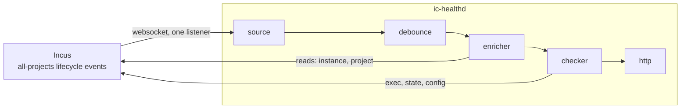
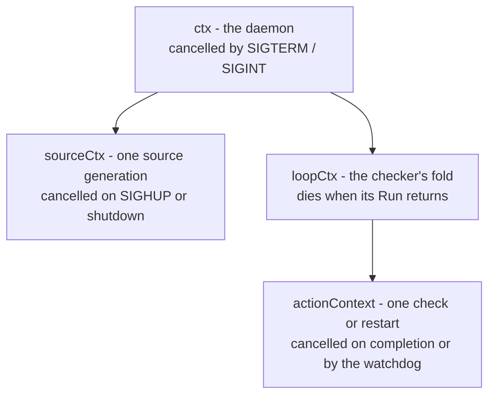
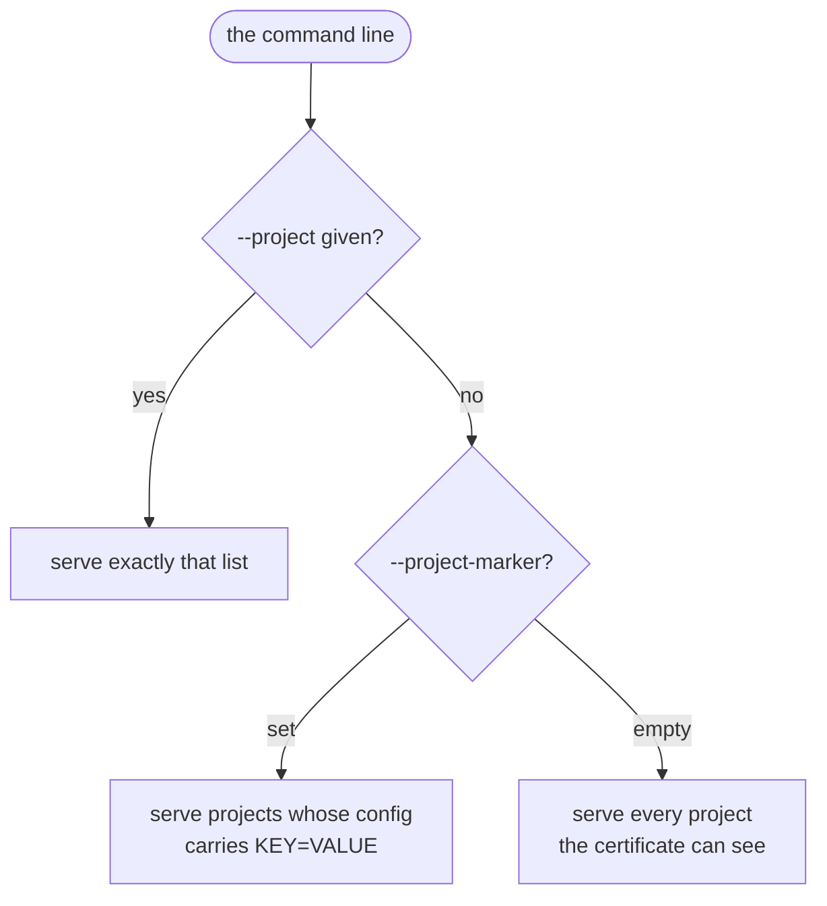
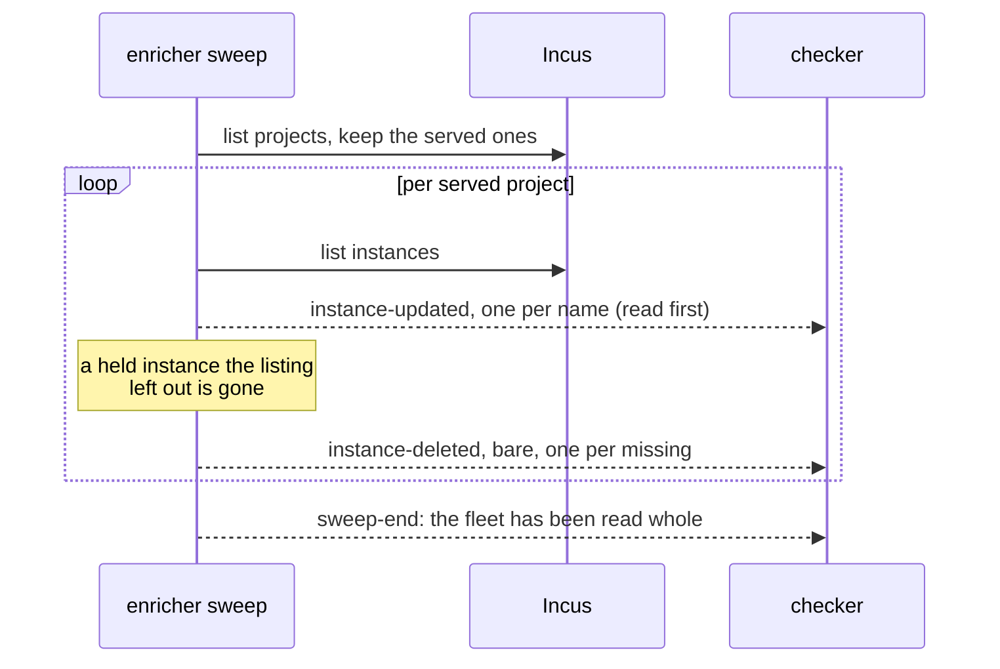
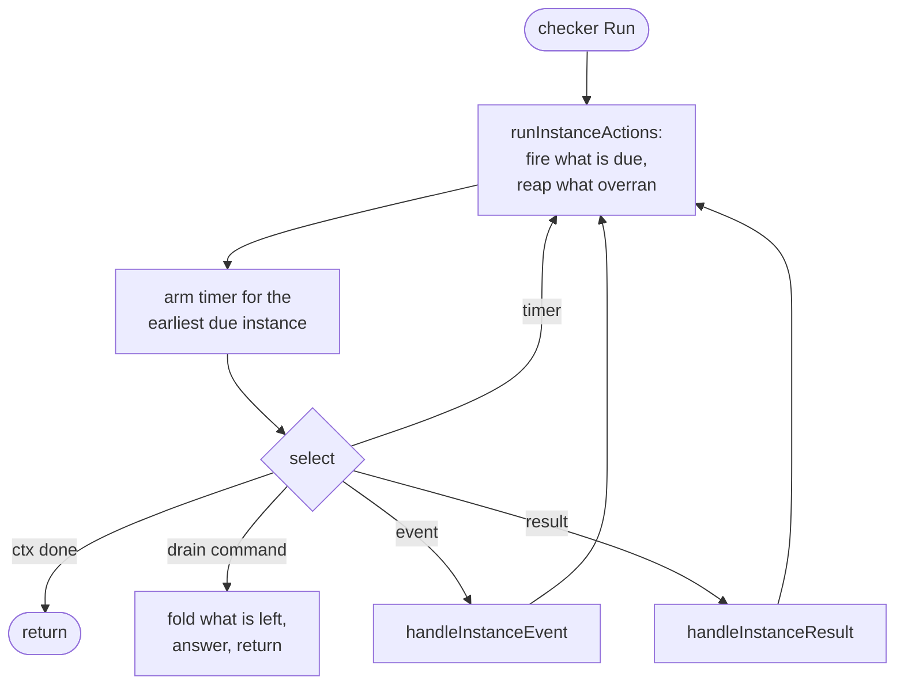
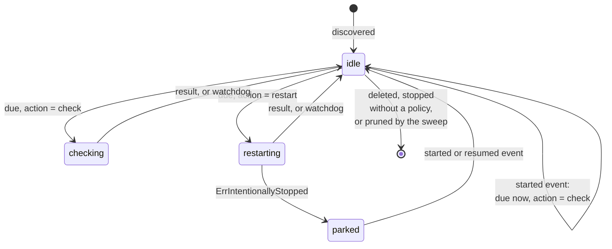
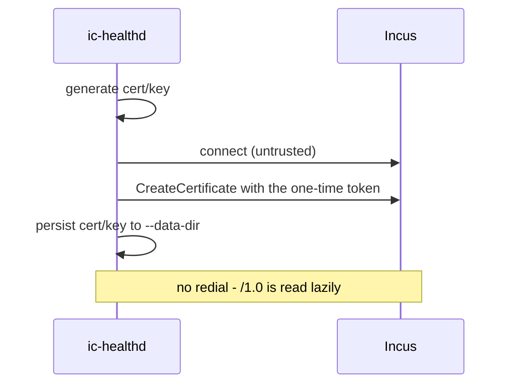

# ic-healthd Internals

How the daemon is put together. For what it does and how to configure it, see
[Health Checking](/healthd); this page is about the parts inside.

The daemon is an ievent chain, the same shape as `ic-dns`: one binary composes a
fixed list of plugins at compile time, and events walk it in order.



| Part     | Count                             | Owns                                                    |
| -------- | --------------------------------- | ------------------------------------------------------- |
| source   | one                               | the listener, the reconnect loop, event order           |
| enricher | one                               | what the fleet looks like now: reads, the sweep, scope  |
| checker  | one                               | every watched instance, its timers and the worker pools |
| http     | one                               | `/metrics`, `/health` and `/ready`                      |
| A worker | `--workers` + `--restart-workers` | one check or restart, whichever project it came from    |

One websocket serves every project, as before: a project costs a map entry in
the enricher and the checker, not a connection and a reconnect loop.

## Why one listener

A restricted certificate may open an all-projects listener, and Incus filters it
down to the projects that certificate is allowed. The events endpoint takes a
different path when `all-projects=true` is set: it builds a permission checker
rather than checking one project up front, and the TLS driver returns a filter
over the certificate's project list. So the daemon asks for everything and
receives exactly what it may see, with no per-project bookkeeping of its own.

The same filter governs `GET /1.0/projects`, which is what makes the sweep safe
to run against the whole server: it only ever lists what the certificate may
see.

## Lifetimes

The chain's goroutines nest under one context, and the source's session is a
child of it:



The load-bearing detail is that **the checker hangs off `ctx`, not off
`sourceCtx`**. A reconnect - or a SIGHUP, which ends the generation on purpose -
replaces only the listener; the checker keeps its instances, failure counts,
backoff and last reported status across it. The enricher answers the reconnect
by restarting its sweep, so what happened while the stream was down is read back
rather than trusted.

## Scope

The decision is made once, in the binary, from the command line, and handed to
the two plugins that need it:



- The enricher gets it as a predicate over a read project, and its sweep only
  lists and reads the projects that pass.
- The checker gets the same policy per event: an explicit list checks the
  event's project name, a marker checks the config the enricher attached to the
  event. An event whose project the enricher holds nothing for is not watched -
  believing a missing read would watch what never opted in.

`--project-marker` is a `KEY=VALUE` pair, defaulting to
`user.healthcheck.scope=global`; a bare key means `KEY=true`. incus-compose
stamps the scope on a project in `healthdUp`, after removing any sidecar the
project owned, so no project is ever in two daemons' scope at once.

That the match is on a _value_ and not merely on a key present is what makes the
upgrade safe: a project scoped to its own sidecar carries `project` and a
project from before the key existed carries nothing, so neither matches
`global`. For the operator's view of the same thing, see
[Choosing what to watch](#choosing-what-to-watch).

A project opting in while the daemon runs is picked up by the sweep: the marker
is read when the project is next read, which the sweep does on every reconnect
and on its own interval. Instance events in the project do not wait for it -
they are judged against whatever the enricher holds, and a project it does not
hold yet is read on first sight.

## Discovery and pruning

The old daemon re-read each watched project on demand; the chain reads the fleet
as a matter of course.



The sweep trickles an `instance-updated` event for every instance it names, so
discovery and a config change are the same event to the checker. A name the
enricher held that the listing left out becomes a bare `instance-deleted` - bare
because a delete needs no read, the name is in the event. The checker treats it
like any other delete: cancel what is in flight for it, forget it.

The sweep runs at startup, after every reconnect, and on its own interval. A
reconnect is exactly when things may have changed unseen, so the enricher
restarts the sweep the moment the source reports the stream back.

## The checker

One fold loop owns the instances map of every watched project, keyed by
`project/name`: no other goroutine reads or writes it, which is why the handlers
can be plain functions over the map with no locking.



`handleInstanceEvent` and `handleInstanceResult` must never block: anything that
talks to Incus is started on its own goroutine and reports back through the
results channel. The loop's job is to stay responsive.

Events arrive on an inbox rather than straight into the loop: `Handle` runs on
the enricher's goroutine and must not block, so a full inbox is a marked drop
rather than a wait. The drop is visible - the event walks on, tagged with who
dropped it - which is the chain's version of the old router's backpressure
story. The old daemon blocked instead and let a wedged scheduler stall the
listener until it closed; the chain marks and moves on, and the sweep repairs
whatever was missed.

### Worker pools

Checks and restarts run on two `ants` pools, fleet-wide as before. They are
separate because a restart holds its worker for up to `restartTimeout`, and a
handful of slow ones must not be able to starve the checks.

Both are non-blocking: a full pool refuses the action instead of queueing it,
and `runInstanceActions` leaves the instance idle and re-dues it
`poolRetryDelay` later. Queueing would be worse than refusing on both counts - a
submit that blocks stalls the loop, while a task waiting for a worker burns the
deadline the watchdog reaps it by, which for a check counts as a failed probe.

The state, the deadline and the context are set only once the pool accepts, so a
refused action is indistinguishable from one that was never due.

### Instance state



`instanceState` is a single value rather than a set of booleans, so the
combinations that cannot happen also cannot be represented. An idle instance
carries `action`, which says what fires when `due` arrives; a check and a
restart are mutually exclusive, since an instance awaiting a restart is stopped
and checking a stopped instance is pointless.

A **started event**, which a resume counts as, puts an idle or parked instance
back into the shape a fresh start leaves it in (`instanceStarted`): due for a
check at once, failure run cleared, start period re-armed. That is also what
discards a restart the stop before it had queued - an instance somebody else
already started has nothing left to restart, and firing it anyway would
force-stop a running instance one backoff later. An instance with an action in
flight is left alone; its result says what happens next.

### Telling results apart

Each in-flight action gets a fresh context, and the result carries it back. The
loop compares that against the context it still holds:

```go
if res.ctx != inst.actionContext {
    // The watchdog gave up on this one and something else has the slot now.
    return
}
```

This matters because cancelling an abandoned action unblocks both its send and
the `ctx.Done()` arm of the same select, so roughly half of all abandoned
actions still deliver a result. Identity is what makes those harmless.

The watchdog itself lives in `runInstanceActions`: an action past its deadline
is cancelled and its slot freed. A check that overran counts as a failed probe,
matching docker; a restart that overran counts as a failed restart and widens
the backoff.

## Running the daemon directly

`incus-compose up` creates the sidecar and injects the configuration below as
environment variables. You can also run `ic-healthd run` yourself - as a binary
or a separately managed container - and attach projects to it with
`up --external-healthd` (see
[Health Checking - Using Your Own healthd](/healthd#using-your-own-healthd)).

Every sidecar flag has a matching env var:

| Flag                | Env var                                 | Default                         | Description                                                                 |
| ------------------- | --------------------------------------- | ------------------------------- | --------------------------------------------------------------------------- |
| `--incus`           | `INCUS_COMPOSE_HEALTHD_INCUS`           | -                               | Incus API URL to connect to                                                 |
| `--token`           | `INCUS_COMPOSE_HEALTHD_TOKEN`           | -                               | Trust token used to register the client cert                                |
| `--project`         | `INCUS_COMPOSE_HEALTHD_PROJECTS`        | -                               | Projects to manage; empty means every marked project                        |
| `--project-marker`  | `INCUS_COMPOSE_HEALTHD_PROJECT_MARKER`  | `user.healthcheck.scope=global` | Project config `KEY=VALUE` that opts a project in when `--project` is empty |
| `--own-project`     | `INCUS_COMPOSE_HEALTHD_OWN_PROJECT`     | -                               | Project the daemon's own container runs in                                  |
| `--own-name`        | `INCUS_COMPOSE_HEALTHD_OWN_NAME`        | -                               | The daemon's own instance name; empty means it skips itself                 |
| `--data-dir`        | `INCUS_COMPOSE_HEALTHD_DATA_DIR`        | `/var/lib/ic-healthd`           | Persistent directory for the generated cert/key                             |
| `--secrets-dir`     | `INCUS_COMPOSE_HEALTHD_SECRETS_DIR`     | `/run/secrets`                  | Tmpfs directory holding the one-time registration token file                |
| `--workers`         | `INCUS_COMPOSE_HEALTHD_WORKERS`         | `128`                           | Health checks running at once, over every watched project                   |
| `--restart-workers` | `INCUS_COMPOSE_HEALTHD_RESTART_WORKERS` | `32`                            | Restarts running at once, over every watched project                        |
| `--http`            | `INCUS_COMPOSE_HEALTHD_HTTP`            | `:8080`                         | Address for `/metrics`, `/health` and `/ready`; empty disables it           |
| `--debug`           | `INCUS_COMPOSE_HEALTHD_DEBUG`           | `false`                         | Verbose logging                                                             |
| `--trace`           | `INCUS_COMPOSE_HEALTHD_TRACE`           | `false`                         | Per-event logging, which implies `--debug`                                  |

Standalone debugging gets a few more, flags only: `--client-cert` and
`--client-key` present an already-trusted pair instead of enrolling, and
`--remote` with `--use-remote` connects as a remote from the Incus CLI
configuration - the developer's path, tried last.

`--own-project` and `--own-name` are how the daemon writes its own health
status; leaving `--own-name` empty means it skips itself.

### Choosing what to watch

There are two ways to say it, and they do not mix:

- **An explicit list.** `--project a --project b` (or
  `INCUS_COMPOSE_HEALTHD_PROJECTS=a,b`) watches exactly those, marker ignored.
- **The marker.** With no `--project`, every project the daemon can see carrying
  `user.healthcheck.scope: "global"` in its _project_ config. incus-compose
  stamps that on the projects it hands to the shared daemon, so a daemon started
  this way picks those up and leaves everything else - project-scoped projects,
  projects from before the key existed, and anything not incus-compose's -
  alone. `--project-marker` selects a different pair, e.g.
  `--project-marker user.mine=yes`; a bare key means `KEY=true`.

**The trust token is what bounds "can see".** A token restricted to two projects
gives a daemon that watches at most those two, whatever its flags say - Incus
filters both the project list and the event stream by what the certificate is
allowed. An unrestricted token means every project on the server.

```bash
# every marked project the token allows
incus config trust add healthd --restricted --projects=blog,shop
ic-healthd run

# exactly these two, marker or not
ic-healthd run --project blog --project shop
```

Projects created, renamed or deleted while the daemon runs are picked up from
the event stream and the sweep; no reload is needed.

### Local binary in the sidecar

```bash
incus-compose up --healthd-binary ./bin/ic-healthd
```

Uses `images:alpine/edge` instead of the published OCI image and pushes the
local binary into the container before start. Useful when iterating on the
daemon but still wanting `up` to manage its lifecycle.

### Standalone on the host

The fastest edit-run-reload loop when hacking on the daemon: run `ic-healthd` on
the host and attach a project to it with `--external-healthd`.

> The daemon registers over the Incus HTTPS API, so the default remote must
> expose an HTTPS address (not just the local unix socket).

1. Build and start the daemon; the token is minted inline and passed via
   `INCUS_COMPOSE_HEALTHD_TOKEN`:

   ```bash
   # The Incus project to watch (its Incus name).
   export INCUS_COMPOSE_HEALTHD_PROJECTS=many-dependencies

   mkdir -p ./work/{secrets,data}
   rm -f ./work/data/*

   # HTTPS address of the default remote.
   export INCUS_COMPOSE_HEALTHD_INCUS=$(default=$(incus remote get-default); incus remote list --format=json | jq -r '."'$default'" .Addrs[0]')
   # A restricted, project-scoped trust token.
   export INCUS_COMPOSE_HEALTHD_TOKEN="$(incus -q config trust add manual_healthd --projects=$INCUS_COMPOSE_HEALTHD_PROJECTS --restricted)"

   just build-healthd
   ./bin/ic-healthd run --debug --secrets-dir=./work/secrets/ --data-dir=./work/data/
   ```

   On first run it consumes the token and writes the cert/key to `./work/data`,
   reusing them afterwards (delete `./work/data/*` to re-register).

2. Note the PID from the startup log (or use `pidof ic-healthd`):

   ```
   time=2026-07-04T15:47:24.177+02:00 level=INFO msg=Starting version=v1.4.0 pid=446206 incus=https://10.0.0.1:8443 http=:8080
   ```

3. In another terminal, bring the project up against the running daemon.
   `--external-healthd` makes incus-compose use healthd features without
   creating or looking up a sidecar of its own:

   ```bash
   just run -P examples/many-dependencies/ up --external-healthd
   ```

4. Config key changes (and instance create/start/stop/delete) take effect on
   their own via the Incus event stream - no reload needed. Force a full manual
   resync if you ever want one, by sending SIGHUP:

   ```bash
   kill -HUP <pid-from-step-2>
   ```

   The daemon answers it by ending the listener's generation and starting a
   fresh one; the reconnect restarts the enricher's sweep, which re-reads the
   fleet. The checker keeps its state across it. `incus-compose healthd reload`
   does the same from inside a project.

## Upstream behaviour worth knowing

Three things about Incus shape this code and would otherwise look like mistakes.

**Only empty projects can be renamed.** `projectIsEmpty` rejects a rename when
anything but the default profile is in the project, so a rename can never lose
watched instances. Nothing in the chain watches project events: instances of a
renamed project simply arrive under the new name, and there were none to carry
over.

**A rename does not refresh incusd's certificate cache.**
`certificates_projects` is keyed by project ID, so the database follows a
rename, but the in-memory cache the authorizer reads still holds the old name
until something else refreshes it. A daemon on a restricted token can therefore
get 403s on the renamed project for a while. Combined with the point above, the
blast radius is small enough to log and carry on.

**`project-updated` is sent before the change is applied.** `api_project.go`
calls `SendLifecycle` and only then `projectChange`, and the event carries a nil
`Context`, so there is no config on it to read either. The chain does not react
to project events at all, which is what defuses it: scope is judged per instance
event against what the enricher holds or reads, and a project's config is read
when an instance in it first moves - by then the write has landed. A project
that opts in while quiet waits for the sweep, which re-reads every project it
can see.

## Registration



Registration is `incustrust`, the same path `ic-dns` uses: an explicit pair is
presented as-is, a persisted pair is reused, and only a fresh token generates
and enrolls. The reading of `/1.0` is lazy in this client, so the connection
that enrolled is the one that serves; nothing is redialed.

The token is consumed on that first run and never needed again. In the normal
flow incus-compose supplies it via `INCUS_COMPOSE_HEALTHD_TOKEN`; running the
daemon by hand, pass `--token` or drop a token file in `--secrets-dir`. Deleting
the contents of `--data-dir` forces a fresh registration.

The token also carries the scope: Incus takes the certificate's name and project
restriction from the token, not from what the daemon asks for. A restricted
token is what bounds a daemon, whatever its flags say.

## See Also

- [Health Checking](/healthd) - configuration, keys, and the management commands
- [Architecture](/developer) - how the sidecar fits the resource model
- [Client Package](/developer/client) - the client the daemon does not use;
  ic-healthd talks to `iclient` directly
