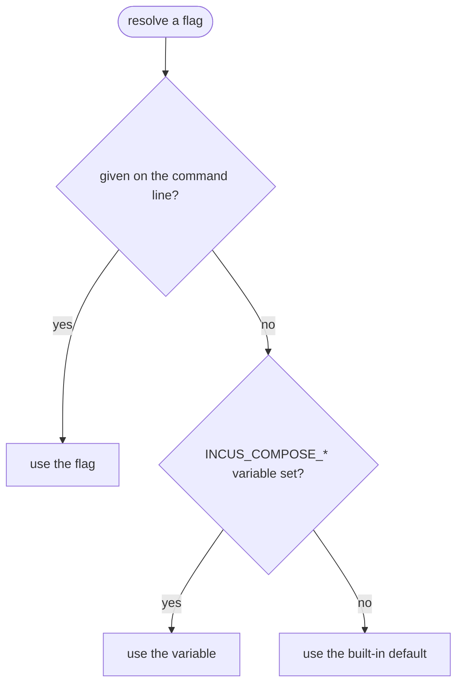

# Environment Variables

incus-compose handles environment variables differently than docker-compose for
security and reproducibility reasons.

## How It Works

### Default Behavior

By default, incus-compose loads environment variables from:

1. `.env` file in the compose file's directory
2. Files specified with `--env-file`

These `.env` files **can reference OS environment variables** for interpolation:

```env
# .env
DB_PASSWORD=secret123
HOME_DIR=${HOME}
CURRENT_USER=${USER}
```

Only variables explicitly defined in `.env` files are passed to your compose
project. Your shell's environment (like `PATH`, `EDITOR`, etc.) is **not**
automatically included.

Values are not treated literally: a `$` inside a value is itself interpolated
(`PASSWORD=abc$def` becomes `abc`, since `$def` resolves to nothing), and a
single-quoted value has no way to represent a literal `'`. Only double-quoting
with backslash-escaping (`\\`, `\"`, `\$`) round-trips a value containing any of
these characters.


### Why This Matters

- **Security**: Sensitive environment variables from your shell don't
  accidentally leak into containers
- **Reproducibility**: The same compose file behaves the same way on different
  machines
- **Explicitness**: You always know exactly which variables are available

## The `--os-env` / `-E` Flag

If you need full docker-compose compatibility, use the `--os-env` flag:

```bash
incus-compose --os-env up
incus-compose -E up
```

This includes all OS environment variables directly, matching docker-compose
behavior.

`--os-env` resolves before `.env`/`--env-file` in the merge order: when a key is
set by both, the shell's value wins and the `.env` value for that key is dropped
rather than overriding it.

## Examples

### Using .env files (recommended)

```env
# .env
DATABASE_URL=postgres://localhost/mydb
API_KEY=your-api-key
USER=${USER}
```

```yaml
# compose.yaml
services:
  app:
    environment:
      DATABASE_URL: ${DATABASE_URL}
      API_KEY: ${API_KEY}
      DEPLOYED_BY: ${USER}
```

```bash
incus-compose up
```

### Using --os-env for compatibility

```bash
export DATABASE_URL=postgres://localhost/mydb
incus-compose --os-env up
```

## Quick Reference

| Method     | Variables Available                         | Use Case                                    |
| ---------- | ------------------------------------------- | ------------------------------------------- |
| Default    | `.env` files only (can interpolate OS vars) | Production, CI/CD                           |
| `--os-env` | All OS environment variables                | Quick testing, docker-compose compatibility |

## CLI Configuration

Every global flag can be set via an environment variable. Flags given on the
command line take precedence over environment variables.



Every command-specific flag can be set too, scoped per command as
`INCUS_COMPOSE_<COMMAND>_<FLAG>` - e.g. `--timeout` on `up` is
`INCUS_COMPOSE_UP_TIMEOUT`, `--timeout` on `down` is
`INCUS_COMPOSE_DOWN_TIMEOUT`. Each command gets its own variable even when the
flag name is shared, so setting one never leaks into another command. See
[Command Flags](#command-flags) for the full list, or run
`incus-compose <command> --help` - every flag's env var is shown inline as
`[$VAR_NAME]`.

Nine flags are the deliberate exception and have **no** environment variable,
because a forgotten shell variable would silently make every future invocation
destructive or a no-op instead of just changing cosmetic output:

| Flag         | Command          | Why                                                           |
| ------------ | ---------------- | ------------------------------------------------------------- |
| `--recreate` | `up`             | Would silently recreate containers on every `up`              |
| `--project`  | `down`           | Would silently delete the whole project                       |
| `--volumes`  | `down`           | Would silently delete volumes                                 |
| `--dry-run`  | `exec`           | Would silently no-op every `exec`, breaking scripts           |
| `--dry-run`  | `cp`             | Would silently no-op every copy                               |
| `--dry-run`  | `port-forward`   | Would silently no-op every forward                            |
| `--signal`   | `kill`           | Takes only `SIGKILL`, which is already the default            |
| `--yes`      | `backup restore` | Would silently skip the confirmation on a destructive restore |
| `--dry-run`  | `backup restore` | Would silently no-op every restore                            |

### Project and Files

| Variable                          | Flag                        | Description                                                  |
| --------------------------------- | --------------------------- | ------------------------------------------------------------ |
| `INCUS_COMPOSE_FILE`              | `--file`, `-f`              | Compose configuration files (comma-separated for multiple)   |
| `INCUS_COMPOSE_PROJECT_NAME`      | `--project-name`, `-p`      | Project name                                                 |
| `INCUS_COMPOSE_PROJECT_DIRECTORY` | `--project-directory`, `-P` | Working directory                                            |
| `INCUS_COMPOSE_ENV_FILE`          | `--env-file`                | Alternative environment files (comma-separated for multiple) |
| `INCUS_COMPOSE_PROFILES`          | `--profile`                 | Profiles to enable (comma-separated for multiple)            |
| `INCUS_COMPOSE_OS_ENV`            | `--os-env`, `-E`            | Include OS environment variables for interpolation           |

### Incus Connection

| Variable                     | Flag             | Description                                                                                                                                                                                                         |
| ---------------------------- | ---------------- | ------------------------------------------------------------------------------------------------------------------------------------------------------------------------------------------------------------------- |
| `INCUS_REMOTE`               | `--remote`       | Incus remote name from CLI config (e.g., `local`, `myserver`)                                                                                                                                                       |
| `INCUS_COMPOSE_IMAGE_CACHE`  | `--image-cache`  | Incus project used as image cache (`INCUS_COMPOSE_IMAGE_CACHE`, default: `incus-compose-cache`); set `""` to disable caching and pull straight into the project, see [CLI Reference](/cli-reference#global-options) |
| `INCUS_COMPOSE_STORAGE_POOL` | `--storage-pool` | Default storage pool (default: `detect`)                                                                                                                                                                            |

### Display and Debugging

| Variable                | Flag        | Description                                                      |
| ----------------------- | ----------- | ---------------------------------------------------------------- |
| `INCUS_COMPOSE_ANSI`    | `--ansi`    | Control ANSI output: `never`, `always`, `auto` (default: `auto`) |
| `INCUS_COMPOSE_DEBUG`   | `--debug`   | Enable debug logging (`true`/`1`)                                |
| `INCUS_COMPOSE_TRACE`   | `--trace`   | Per-event logging, which implies `--debug`; read by ic-healthd   |
| `INCUS_COMPOSE_WORKERS` | `--workers` | Number of concurrent workers (default: `4`)                      |
| `NO_COLOR`              | --          | Disable color output ([no-color.org](https://no-color.org/))     |

`--builder` and `--healthd-*` are command flags (`up`, `build`, `pull`,
`healthd up`, `healthd down`), not global ones - see
[Command Flags](#command-flags) below for their per-command variable names.

The ic-healthd daemon reads a further set of `INCUS_COMPOSE_HEALTHD_*` variables
of its own, which incus-compose injects into the sidecar - see
[The ic-healthd daemon](#the-ic-healthd-daemon) below.

### Examples

```bash
# Use a configured Incus remote
export INCUS_REMOTE=myserver
incus-compose up

# Set project defaults in your shell profile
export INCUS_COMPOSE_FILE=compose.yaml,compose.prod.yaml
export INCUS_COMPOSE_PROJECT_NAME=myapp
incus-compose up

# Debug with extra workers
INCUS_COMPOSE_DEBUG=1 INCUS_COMPOSE_WORKERS=20 incus-compose up
```

## Command Flags

Every flag on every command below can be set via
`INCUS_COMPOSE_<COMMAND>_<FLAG>`, except the four listed under
[CLI Configuration](#cli-configuration). Descriptions are abbreviated; run
`incus-compose <command> --help` for the full text and defaults.

### up / down / start / stop / kill / restart / pause / unpause

| Command   | Variable                              | Flag                   | Description                               |
| --------- | ------------------------------------- | ---------------------- | ----------------------------------------- |
| `up`      | `INCUS_COMPOSE_UP_NO_START`           | `--no-start`           | Don't start containers after creating     |
| `up`      | `INCUS_COMPOSE_UP_TIMEOUT`            | `--timeout`            | Timeout for stopping/starting a service   |
| `up`      | `INCUS_COMPOSE_UP_DEPENDENCY_TIMEOUT` | `--dependency-timeout` | Max wait for `service_healthy` depends_on |
| `up/down` | `INCUS_COMPOSE_SCALE`                 | `--scale`              | Scale SERVICE to NUM instances            |
| `up`      | `INCUS_COMPOSE_UP_PULL`               | `--pull`               | Pull policy                               |
| `up`      | `INCUS_COMPOSE_UP_BUILD`              | `--build`              | Build images before starting              |
| `up`      | `INCUS_COMPOSE_UP_BUILDER`            | `--builder`            | Preferred builder binary or path          |
| `up`      | `INCUS_COMPOSE_UP_NO_BUILD`           | `--no-build`           | Do not build images even if missing       |
| `up`      | `INCUS_COMPOSE_UP_NO_DEPS`            | `--no-deps`            | Don't start linked services               |
| `up`      | `INCUS_COMPOSE_UP_DETACH`             | `--detach`, `-d`       | Run containers in the background          |
| `up/down` | `INCUS_COMPOSE_NO_HEALTHD`            | `--no-healthd`         | Don't create the healthd sidecar          |
| `up`      | `INCUS_COMPOSE_EXTERNAL_HEALTHD`      | `--external-healthd`   | Use healthd but don't create/look it up   |
| `up`      | `INCUS_COMPOSE_HEALTHD_IMAGE`         | `--healthd-image`      | Healthd OCI image                         |
| `up`      | `INCUS_COMPOSE_HEALTHD_BINARY`        | `--healthd-binary`     | Local ic-healthd binary path              |
| `up`      | `INCUS_COMPOSE_HEALTHD_INCUS`         | `--healthd-incus`      | Incus API URL for the sidecar             |
| `up`      | `INCUS_COMPOSE_HEALTHD_NETWORK`       | `--healthd-network`    | Network for the sidecar                   |
| `up`      | `INCUS_COMPOSE_HEALTHD_SCOPE`         | `--healthd-scope`      | `global` or `project`                     |
| `down`    | `INCUS_COMPOSE_DOWN_RMI`              | `--rmi`                | Remove images used by services            |
| `down`    | `INCUS_COMPOSE_DOWN_IMAGES`           | `--images`             | Remove known images from the project      |
| `down`    | `INCUS_COMPOSE_DOWN_TIMEOUT`          | `--timeout`            | Timeout for stopping                      |
| `down`    | `INCUS_COMPOSE_DOWN_NO_DEPS`          | `--no-deps`            | Don't stop linked services                |
| `down`    | `INCUS_COMPOSE_EXTERNAL_HEALTHD`      | `--external-healthd`   | Use healthd but don't look it up          |
| `down`    | `INCUS_COMPOSE_DOWN_NO_NETWORKS`      | `--no-networks`        | Don't touch networks                      |
| `start`   | `INCUS_COMPOSE_START_TIMEOUT`         | `--timeout`            | Timeout for starting                      |
| `start`   | `INCUS_COMPOSE_START_WITH_DEPS`       | `--with-deps`          | Also start linked services                |
| `stop`    | `INCUS_COMPOSE_STOP_TIMEOUT`          | `--timeout`            | Timeout for stopping                      |
| `stop`    | `INCUS_COMPOSE_STOP_WITH_DEPS`        | `--with-deps`          | Also stop linked services                 |
| `kill`    | `INCUS_COMPOSE_STOP_WITH_DEPS`        | `--with-deps`          | Also kill linked services                 |
| `pause`   | `INCUS_COMPOSE_PAUSE_WITH_DEPS`       | `--with-deps`          | Also pause linked services                |
| `unpause` | `INCUS_COMPOSE_UNPAUSE_WITH_DEPS`     | `--with-deps`          | Also unpause linked services              |
| `restart` | `INCUS_COMPOSE_RESTART_TIMEOUT`       | `--timeout`            | Timeout for stopping and starting         |
| `restart` | `INCUS_COMPOSE_RESTART_WITH_DEPS`     | `--with-deps`          | Also restart linked services              |

`kill` is the one command that reads another's variables: it is `stop` without
the graceful shutdown, so it takes `INCUS_COMPOSE_STOP_WITH_DEPS` rather than a
pair of its own.

`up --recreate` and `down --project`/`--volumes` have no variable - see the
exceptions table above.

### build / pull

| Command | Variable                                  | Flag                     | Description                       |
| ------- | ----------------------------------------- | ------------------------ | --------------------------------- |
| `build` | `INCUS_COMPOSE_BUILD_NO_CACHE`            | `--no-cache`             | Do not use a cache when building  |
| `build` | `INCUS_COMPOSE_BUILD_PULL`                | `--pull`                 | Pull policy                       |
| `build` | `INCUS_COMPOSE_BUILD_BUILDER`             | `--builder`              | Preferred builder binary or path  |
| `pull`  | `INCUS_COMPOSE_PULL_IGNORE_BUILDABLE`     | `--ignore-buildable`     | Ignore images that can be built   |
| `pull`  | `INCUS_COMPOSE_PULL_IGNORE_PULL_FAILURES` | `--ignore-pull-failures` | Pull what it can, ignore failures |
| `pull`  | `INCUS_COMPOSE_PULL_INCLUDE_DEPS`         | `--include-deps`         | Also pull linked services         |
| `pull`  | `INCUS_COMPOSE_PULL_POLICY`               | `--policy`               | Pull policy                       |
| `pull`  | `INCUS_COMPOSE_NO_HEALTHD`                | `--no-healthd`           | Don't pull the healthd sidecar    |
| `pull`  | `INCUS_COMPOSE_HEALTHD_IMAGE`             | `--healthd-image`        | Healthd OCI image                 |

### backup

| Command          | Variable                                | Flag          | Description                          |
| ---------------- | --------------------------------------- | ------------- | ------------------------------------ |
| all              | `INCUS_COMPOSE_BACKUP_POOL`             | `--pool`      | Storage pool for backup volumes      |
| `backup list`    | `INCUS_COMPOSE_BACKUP_LIST_FORMAT`      | `--format`    | Output format                        |
| `backup verify`  | `INCUS_COMPOSE_BACKUP_VERIFY_FORMAT`    | `--format`    | Output format                        |
| `backup restore` | `INCUS_COMPOSE_BACKUP_RESTORE_VOLUME`   | `--volume`    | Restore only these volumes           |
| `backup delete`  | `INCUS_COMPOSE_BACKUP_DELETE_KEEP_LAST` | `--keep-last` | Delete every backup but the newest N |

### config

| Variable                           | Flag             | Description                              |
| ---------------------------------- | ---------------- | ---------------------------------------- |
| `INCUS_COMPOSE_CONFIG_FORMAT`      | `--format`       | Output format: `yaml` or `json`          |
| `INCUS_COMPOSE_CONFIG_SERVICES`    | `--services`     | Print the service names, one per line    |
| `INCUS_COMPOSE_CONFIG_VOLUMES`     | `--volumes`      | Print the volume names, one per line     |
| `INCUS_COMPOSE_CONFIG_NETWORKS`    | `--networks`     | Print the network names, one per line    |
| `INCUS_COMPOSE_CONFIG_PROFILES`    | `--profiles`     | Print the profile names, one per line    |
| `INCUS_COMPOSE_CONFIG_QUIET`       | `--quiet`, `-q`  | Only validate, don't print anything      |
| `INCUS_COMPOSE_CONFIG_IMAGES`      | `--images`       | Print the image names, one per line      |
| `INCUS_COMPOSE_CONFIG_ENVIRONMENT` | `--environment`  | Print environment used for interpolation |
| `INCUS_COMPOSE_CONFIG_VARIABLES`   | `--variables`    | Print model variables and default values |
| `INCUS_COMPOSE_CONFIG_OUTPUT`      | `--output`, `-o` | Save to file (default: stdout)           |

### list / ps

| Command | Variable                     | Flag            | Description                              |
| ------- | ---------------------------- | --------------- | ---------------------------------------- |
| `list`  | `INCUS_COMPOSE_LIST_FORMAT`  | `--format`      | Output format: `table`, `yaml` or `json` |
| `list`  | `INCUS_COMPOSE_NO_HEALTHD`   | `--no-healthd`  | Don't list the healthd sidecar           |
| `ps`    | `INCUS_COMPOSE_PS_ALL`       | `--all`, `-a`   | Show all containers, including stopped   |
| `ps`    | `INCUS_COMPOSE_PS_QUIET`     | `--quiet`, `-q` | Only display Incus instance names        |
| `ps`    | `INCUS_COMPOSE_PS_SERVICES`  | `--services`    | Display services instead of instances    |
| `ps`    | `INCUS_COMPOSE_PS_FORMAT`    | `--format`      | Output format: `table` or `json`         |
| `ps`    | `INCUS_COMPOSE_PS_WITH_DEPS` | `--with-deps`   | Also list linked services                |

### run

| Command             | Variable                          | Flag                    | Description                                   |
| ------------------- | --------------------------------- | ----------------------- | --------------------------------------------- |
| `run`               | `INCUS_COMPOSE_RUN_RM`            | `--rm`                  | Remove the instance after the command exits   |
| `run`               | `INCUS_COMPOSE_RUN_DETACH`        | `--detach`, `-d`        | Print the instance name and return            |
| `run`               | `INCUS_COMPOSE_RUN_ENV`           | `--env`, `-e`           | Set environment variables (KEY=VALUE)         |
| `run`               | `INCUS_COMPOSE_RUN_LABEL`         | `--label`, `-l`         | Add a label (KEY=VALUE)                       |
| `run`               | `INCUS_COMPOSE_RUN_VOLUME`        | `--volume`, `-v`        | Bind mount a volume                           |
| `run`               | `INCUS_COMPOSE_RUN_PUBLISH`       | `--publish`, `-p`       | Publish a port                                |
| `run`               | `INCUS_COMPOSE_RUN_SERVICE_PORTS` | `--service-ports`, `-P` | Keep the ports the service declares           |
| `run`               | `INCUS_COMPOSE_RUN_ENTRYPOINT`    | `--entrypoint`          | Override the image entrypoint                 |
| `run`               | `INCUS_COMPOSE_RUN_USER`          | `--user`, `-u`          | Run as this user                              |
| `run`               | `INCUS_COMPOSE_RUN_GROUP`         | `--group`               | Run as this group                             |
| `run`               | `INCUS_COMPOSE_RUN_WORKDIR`       | `--workdir`, `-w`       | Working directory for the command             |
| `run`               | `INCUS_COMPOSE_RUN_NAME`          | `--name`                | Name for the one-off instance                 |
| `run`               | `INCUS_COMPOSE_RUN_NO_TTY`        | `--no-tty`, `-T`        | Disable pseudo-TTY allocation                 |
| `run`               | `INCUS_COMPOSE_RUN_NO_DEPS`       | `--no-deps`             | Don't start the services this one depends on  |
| `run`               | `INCUS_COMPOSE_RUN_BUILD`         | `--build`               | Build the image before running                |
| `run`               | `INCUS_COMPOSE_RUN_NO_BUILD`      | `--no-build`            | Never build                                   |
| `run`               | `INCUS_COMPOSE_RUN_BUILDER`       | `--builder`             | Preferred builder                             |
| `run`               | `INCUS_COMPOSE_RUN_PULL`          | `--pull`                | always / missing / never                      |
| `run`, `pull`, `up` | `INCUS_COMPOSE_INIT_IMAGE`        | `--init`                | Image the blocking helper comes from          |
| `run`               | `INCUS_COMPOSE_RUN_TIMEOUT`       | `--timeout`             | Timeout for creating and stopping the one-off |

### logs / exec / cp / top / events / port / self-update

| Command        | Variable                                | Flag                  | Description                           |
| -------------- | --------------------------------------- | --------------------- | ------------------------------------- |
| `logs`         | `INCUS_COMPOSE_LOGS_FOLLOW`             | `--follow`, `-f`      | Follow log output                     |
| `exec`         | `INCUS_COMPOSE_EXEC_DETACH`             | `--detach`, `-d`      | Run command in the background         |
| `exec`         | `INCUS_COMPOSE_EXEC_ENV`                | `--env`, `-e`         | Set environment variables (KEY=VALUE) |
| `exec`         | `INCUS_COMPOSE_EXEC_INDEX`              | `--index`             | Replica index if service is scaled    |
| `exec`         | `INCUS_COMPOSE_EXEC_NO_TTY`             | `--no-tty`, `-T`      | Disable pseudo-TTY allocation         |
| `exec`         | `INCUS_COMPOSE_EXEC_PRIVILEGED`         | `--privileged`        | Accepted but not implemented          |
| `exec`         | `INCUS_COMPOSE_EXEC_USER`               | `--user`, `-u`        | Run the command as this user          |
| `exec`         | `INCUS_COMPOSE_EXEC_GROUP`              | `--group`, `-g`       | Run the command as this group         |
| `exec`         | `INCUS_COMPOSE_EXEC_WORKDIR`            | `--workdir`, `-w`     | Path to workdir directory             |
| `cp`           | `INCUS_COMPOSE_CP_INDEX`                | `--index`             | Replica index if service is scaled    |
| `cp`           | `INCUS_COMPOSE_CP_ARCHIVE`              | `--archive`, `-a`     | Keep the source's uid/gid             |
| `cp`           | `INCUS_COMPOSE_CP_FOLLOW_LINK`          | `--follow-link`, `-L` | Always follow symlinks in SRC_PATH    |
| `top`          | `INCUS_COMPOSE_TOP_COLUMNS`             | `--columns`, `-c`     | Columns to display                    |
| `top`          | `INCUS_COMPOSE_TOP_FORMAT`              | `--format`            | Output format: table or compact       |
| `top`          | `INCUS_COMPOSE_TOP_REFRESH`             | `--refresh`           | Refresh delay in seconds              |
| `events`       | `INCUS_COMPOSE_EVENTS_TYPE`             | `--type`, `-t`        | Event types to listen for             |
| `events`       | `INCUS_COMPOSE_EVENTS_FORMAT`           | `--format`            | Output format: pretty, yaml or json   |
| `events`       | `INCUS_COMPOSE_EVENTS_JSON`             | `--json`              | Short for `--format=json`             |
| `port`         | `INCUS_COMPOSE_PORT_INDEX`              | `--index`             | Replica index if service is scaled    |
| `port`         | `INCUS_COMPOSE_PORT_PROTOCOL`           | `--protocol`          | Protocol of the port, tcp or udp      |
| `port-forward` | `INCUS_COMPOSE_PORT_FORWARD_INDEX`      | `--index`             | Replica index if service is scaled    |
| `self-update`  | `INCUS_COMPOSE_SELF_UPDATE_DRAFT`       | `--draft`             | Also consider draft releases          |
| `self-update`  | `INCUS_COMPOSE_SELF_UPDATE_PRE_RELEASE` | `--pre-release`       | Also consider pre-releases            |

`exec --dry-run`, `cp --dry-run`, `port-forward --dry-run` and
`backup restore --yes`/`--dry-run` have no variable - see the exceptions table
above.

### healthd up / down / logs / restart

These are the `incus-compose healthd <subcommand>` management commands (see
[CLI Reference](/cli-reference#healthd)), distinct from `up`'s own `--healthd-*`
flags above.

| Command           | Variable                                | Flag             | Description                             |
| ----------------- | --------------------------------------- | ---------------- | --------------------------------------- |
| `healthd up`      | `INCUS_COMPOSE_HEALTHD_IMAGE`           | `--image`        | Healthd OCI image                       |
| `healthd up`      | `INCUS_COMPOSE_HEALTHD_BINARY`          | `--binary`       | Local ic-healthd binary path            |
| `healthd up`      | `INCUS_COMPOSE_HEALTHD_INCUS`           | `--incus`        | Incus API URL for the sidecar           |
| `healthd up`      | `INCUS_COMPOSE_HEALTHD_NETWORK`         | `--network`      | Network for the sidecar (project scope) |
| `healthd up`      | `INCUS_COMPOSE_HEALTHD_SCOPE`           | `--scope`        | `global` or `project`                   |
| `healthd up`      | `INCUS_COMPOSE_HEALTHD_PULL`            | `--pull`         | Pull policy                             |
| `healthd up`      | `INCUS_COMPOSE_HEALTHD_TIMEOUT`         | `--timeout`      | Timeout for stopping                    |
| `healthd down`    | `INCUS_COMPOSE_HEALTHD_IMAGE`           | `--image`        | Healthd OCI image                       |
| `healthd down`    | `INCUS_COMPOSE_HEALTHD_DOWN_FORCE`      | `--force`        | Stop a shared daemon without asking     |
| `healthd down`    | `INCUS_COMPOSE_HEALTHD_TIMEOUT`         | `--timeout`      | Timeout for stopping                    |
| `healthd logs`    | `INCUS_COMPOSE_HEALTHD_LOGS_FOLLOW`     | `--follow`, `-f` | Follow log output                       |
| `healthd restart` | `INCUS_COMPOSE_HEALTHD_RESTART_TIMEOUT` | `--timeout`      | Timeout for stopping                    |

### The ic-healthd daemon

These are read by the `ic-healthd` binary itself, not by incus-compose. In the
normal flow incus-compose sets them on the sidecar and you never touch them;
they matter when you run the daemon yourself (see
[ic-healthd Internals - Running the daemon directly](/architecture/healthd#running-the-daemon-directly)).

| Variable                               | Flag               | Default                         | Description                                                    |
| -------------------------------------- | ------------------ | ------------------------------- | -------------------------------------------------------------- |
| `INCUS_COMPOSE_HEALTHD_INCUS`          | `--incus`          | -                               | Incus API URL the daemon connects to                           |
| `INCUS_COMPOSE_HEALTHD_TOKEN`          | `--token`          | -                               | One-time trust token used to register its cert                 |
| `INCUS_COMPOSE_HEALTHD_PROJECTS`       | `--project`        | -                               | Projects to watch, comma-separated; see below                  |
| `INCUS_COMPOSE_HEALTHD_PROJECT_MARKER` | `--project-marker` | `user.healthcheck.scope=global` | Project config `KEY=VALUE` consulted when `_PROJECTS` is unset |
| `INCUS_COMPOSE_HEALTHD_OWN_PROJECT`    | `--own-project`    | -                               | Project the daemon's own container runs in                     |
| `INCUS_COMPOSE_HEALTHD_OWN_NAME`       | `--own-name`       | -                               | The daemon's own instance name; empty skips itself             |
| `INCUS_COMPOSE_HEALTHD_DATA_DIR`       | `--data-dir`       | `/var/lib/ic-healthd`           | Persistent directory for the generated cert/key                |
| `INCUS_COMPOSE_HEALTHD_SECRETS_DIR`    | `--secrets-dir`    | `/run/secrets`                  | Tmpfs directory holding the token file                         |
| `INCUS_COMPOSE_HEALTHD_DEBUG`          | `--debug`          | `false`                         | Verbose logging                                                |
| `INCUS_COMPOSE_HEALTHD_TRACE`          | `--trace`          | `false`                         | Per-event logging, which implies `--debug`                     |

`_PROJECTS` may be left unset, in which case the daemon watches every project it
can see whose config matches `_PROJECT_MARKER` - by default
`user.healthcheck.scope=global`, which is what incus-compose stamps on the
projects it hands to the shared daemon. A bare key means `KEY=true`. Set
`_PROJECTS` explicitly and it is used verbatim, marker ignored. Either way the
daemon's trust token bounds what it can see at all.

Note that `INCUS_COMPOSE_HEALTHD_INCUS` appears twice on this page with two
different readers: on `up` and `healthd up` it tells _incus-compose_ what
endpoint to configure the sidecar with, and here it is what the _daemon_ dials.
They agree in the normal flow because the former is how the latter gets set.

## See Also

- [CLI Reference](/cli-reference) - command options and flags
- [Compose Compatibility](/compose-compatibility) - interpolation and env_file
  support
