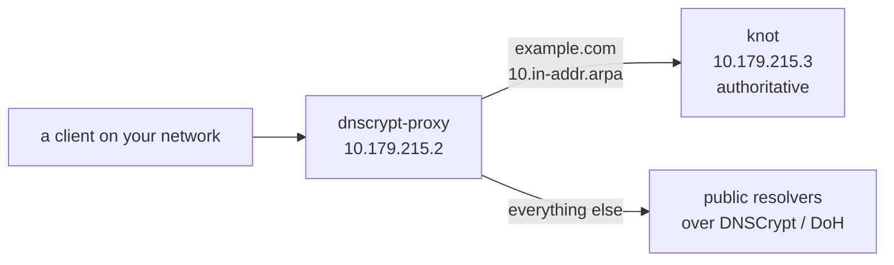

# DNS

A split-horizon home resolver: [dnscrypt-proxy](https://dnscrypt.info/) as the client-facing resolver, [knot](https://www.knot-dns.cz/) as the authoritative server for the local `example.com` zone.

The files for this example are on [Github](https://github.com/lxc/incus-compose/tree/main/examples/dns).

## The example

| Service          | Role                                                                                                                                                 | Static IP      |
| ---------------- | ---------------------------------------------------------------------------------------------------------------------------------------------------- | -------------- |
| `dnscrypt-proxy` | Resolver clients point at. Forwards `example.com` (and `10.in-addr.arpa`) to `knot`; everything else goes out over DNSCrypt/DoH to public resolvers. | `10.179.215.2` |
| `knot`           | Authoritative DNS server for the `example.com` zone.                                                                                                 | `10.179.215.3` |



Both attach to the pre-existing external `incusbr0` network, alongside [`caddy`](https://docs.incus-compose.org/examples/caddy), which serves the `*.example.com` sites this zone resolves to.

## Usage

```bash
incus-compose up
```

Point a client's DNS at `10.179.215.2`.

## Notes

- `knot`'s storage volume is bind-mounted with `x-incus: security.shifted: true` and `initial.uid`/`initial.gid: 53`, so the container's `knot` user (uid/gid 53) owns the files correctly under Incus's idmapped mounts.
