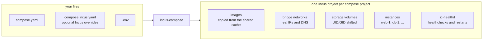

# incus-compose

Bring the familiar Docker Compose workflow to [Incus](https://linuxcontainers.org/incus/). incus-compose implements the Compose specification for the Incus ecosystem, allowing you to define and run multi-container applications using the compose.yaml files you already know.

```yaml
services:
  db:
    image: docker.io/postgres:18-alpine
    healthcheck:
      test: ["CMD", "pg_isready", "-U", "postgres"]
    deploy:
      resources:
        limits:
          cpus: "2"
          memory: 2G

  web:
    image: docker.io/nginx:alpine
    depends_on:
      db: { condition: service_healthy }
    ports:
      - "8080:80"
    deploy:
      resources:
        limits:
          cpus: "1"
          memory: 512M
```

```bash
incus-compose up
```

A plain compose file, running unchanged.

- Use existing `docker-compose.yml` files with Incus containers
- Leverage Incus's native OCI registry support for image pulling
- Run Docker/OCI images directly from registries
- Manage complex multi-container applications with familiar commands
- Benefit from Incus's resource efficiency and security model



New to Incus? See [Why Incus?](/why-incus) for what the platform brings over
a classic OCI engine setup.

## Demos

Recorded during the beta - the workflow is unchanged in current releases:

- [30-service dependency graph, 30 parallel workers](https://asciinema.org/a/1260145)
- [Immich - a full photo-management stack](https://asciinema.org/a/1259458)

## Features

Status: **Stable**.

**The workflow you know:**

- Familiar commands: `up`, `down`, `start`, `stop`, `kill`, `restart`, `pause`/`unpause`, `list` (and `ps`), `logs`, `exec`, `cp`, `top`, `events`, `config`, plus `build`, `healthd`, `incus` (pass-through), and `self-update`
- Compose project parsing via compose-go: `.env` interpolation, profiles, `depends_on`, secrets, and configs
- Automatic `compose.incus.yaml` override file - keep the upstream compose file untouched and put Incus tuning next to it [doc](/compose-compatibility#incus-override-file)
- Configuration via `INCUS_COMPOSE_*` environment variables for every flag, with a configurable parallel worker count [doc](/environment-variables)

**Images:**

- OCI image pulling from docker.io, ghcr.io, and other registries
- Two-stage image cache in a dedicated Incus project (survives `down`/`up`, avoids registry rate limits)
- Local image building via Podman/Docker [doc](/builds)

**Networking:**

- Bridge networks with automatic name sanitization; external pre-existing networks
- Static IPv4/IPv6 addresses with automatic DHCP ranges [doc](/compose-compatibility#automatic-dhcp-ranges)
- Port forwarding via proxy devices or kernel NAT mode [doc](/compose-compatibility#port-publishing)

**Storage:**

- Storage volumes with UID/GID shifting; bind mounts (pass-through by default, optional seeding) [doc](/compose-compatibility#volume-permissions)
- Per-volume storage pool placement - pin a database volume to your fast SSD pool [doc](/compose-compatibility#x-incus-compose-volume-pool)

**Operations:**

- Health checks, restart policies, and `depends_on: service_healthy` ordering via the `ic-healthd` sidecar [doc](/healthd)
- Service scaling with `up --scale` and orphan pruning
- Incus project isolation
- Resource limits and other advanced compose features (`shm_size`, `container_name`, etc.)

**Beyond any OCI engine:**

- Project-wide resource limits - cap CPU and memory for the entire stack, enforced by Incus [doc](/compose-compatibility#projects)
- GPU, USB, and raw disk passthrough per service via `x-incus-compose.devices` [doc](/compose-compatibility#x-incus-compose-devices)
- The full Incus API as an escape hatch: any instance, network, or volume option passes straight through via `x-incus` [doc](/compose-compatibility)

## Quick Start

Requires Incus 7.0.1 (LTS) or 7.2+, `podman` or `docker` for image building and an Incus https remote (needed for healthchecking) with OCI registries added.
See [Getting Started](/getting-started) for the full setup walkthrough.

Install the latest release:

```bash
curl -sSfL https://raw.githubusercontent.com/lxc/incus-compose/main/install.sh | sh -s -- -b ~/.local/bin
```

Or grab a prebuilt archive from the [Releases Page](https://github.com/lxc/incus-compose/releases).
On Arch Linux, install [incus-compose-bin](https://aur.archlinux.org/packages/incus-compose-bin)
(or [incus-compose-git](https://aur.archlinux.org/packages/incus-compose-git) for builds from `main`)
from the AUR.

Then point it at your existing `compose.yaml`:

```bash
# Start services
incus-compose up -d

# View logs
incus-compose logs -f

# List running services
incus-compose list

# Stop and remove
incus-compose down
```

## Quick Links

- **[Architecture](/architecture)** - the resource-first design behind incus-compose
- **[coredns](/coredns)** - DNS for your instances, served from the Incus event stream
- **[Changelog](https://github.com/lxc/incus-compose/blob/main/CHANGELOG.md)** - what changed since 0.0.1-beta1

## Support and community

The following channels are available for questions and discussion around incus-compose.

### Bug reports

You can file bug reports and feature requests at: [`https://github.com/lxc/incus-compose/issues/new`](https://github.com/lxc/incus-compose/issues/new)

### Community support

Community support is handled at: [`https://discuss.linuxcontainers.org`](https://discuss.linuxcontainers.org)

## Contributing

Fixes and new features are greatly appreciated. Make sure to read our [contributing guidelines](https://github.com/lxc/incus-compose/blob/main/CONTRIBUTING.md) first!
